# Lab 0 — Edge AI Vision: TensorFlow Lite Micro *(Student Guide)*

> Adapted from the AIoScout TF Lite Training Manual (2026) for secondary school students.
>
> **Lab focus** — collect images, train an image-classification neural network (no programming required), and run it live on the ESP32-P4 microcontroller.

---

## 1. Overview and Learning Outcomes

This laboratory equips the robot car with visual recognition. By the end you can:

- Set up the **ESP32-P4** development board with the Arduino IDE
- **Collect and preprocess** image samples from a camera
- **Train** a convolutional neural network (CNN) with the **TFLiteTraining** application, without writing training code
- Explain **hyperparameters** and their effect on training results
- **Export** a quantized model and **deploy** it to the microcontroller for real-time inference

**Key words:** machine learning · training · sample · CNN · hyperparameter · overfitting · quantization · inference · edge AI

---

## 2. Background — Machine Learning on a Chip

### 2.1 Rules versus learning

A conventional program follows rules written by a programmer: *if the pixel is dark, do X.* Such rules cannot describe how to recognize a stop sign in an image — no one can write them by hand. **Machine learning** inverts this arrangement: instead of receiving rules, the computer receives many **labeled examples** (images with the correct answer attached) and derives the rules itself. This process is called **training**.

### 2.2 What Is a CNN?

A **Convolutional Neural Network (CNN)** is the standard neural-network architecture for images. It can be understood as a stack of small **feature detectors**: early layers detect simple patterns (edges, blobs), later layers combine them into complex ones (shapes, objects). The final layer outputs a **confidence** for each class — for example, "sign: 92%, wall: 5%, floor: 3%".

### 2.3 What Is TensorFlow Lite Micro?

**TensorFlow Lite Micro** (now called **LiteRT for Microcontrollers**) is a version of Google's ML runtime designed for microcontrollers — chips with only kilobytes of memory:

- The core runtime fits in **16 KB** of memory
- No operating system, no standard C/C++ libraries, and no dynamic memory allocation are required
- Models are **quantized** to **int8** (each number stored as 1 byte instead of 4) so they are small and fast enough for a microcontroller

Running AI directly on the chip, instead of sending images to a server, is called **edge AI**. It provides fast response, requires no network, and preserves privacy.

### 2.4 The ESP32-P4 Development Board

The **ESP32-P4** is a high-performance system-on-a-chip (SoC) from Espressif, designed for exactly this kind of work:

- **Dual-core** processor with sufficient speed for real-time inference
- Rich peripheral interfaces and **camera support** (for example the IMX219 camera module)
- Captures images, processes them on-device, and runs TensorFlow Lite models in real time

It is programmed with the **Arduino IDE** — the same environment used in the earlier labs.

### 2.5 The TFLiteTraining Application

**TFLiteTraining** is a desktop application for training lightweight image classifiers, inspired by Google's Teachable Machine. It supports the complete workflow:

1. **Collect** labeled image samples — from a **webcam**, **uploaded files**, or a **serial camera** (the ESP32-P4)
2. **Preprocess** them (crop, filter noise) — no code required
3. **Train** a CNN by adjusting hyperparameters
4. **Preview** the model's live performance
5. **Export** a fully quantized **int8 TensorFlow Lite model** plus the C/C++ files, ready to deploy to the microcontroller

The workflow of this lab: **Collect → Preprocess → Train → Preview → Export → Deploy**.

---

## 3. Task 1 — Set Up Arduino IDE and the ESP32-P4

### Step-by-step

**Step 1.** Download the latest **Arduino IDE** (version 2.3.10 or higher) from https://www.arduino.cc/en/software and install it.

**Step 2.** Open the settings page (`cmd/ctrl + ,`):

- **macOS:** *Arduino IDE → Settings → Additional Boards Manager URLs*
- **Windows:** *File → Preferences → Settings → Additional Boards Manager URLs*

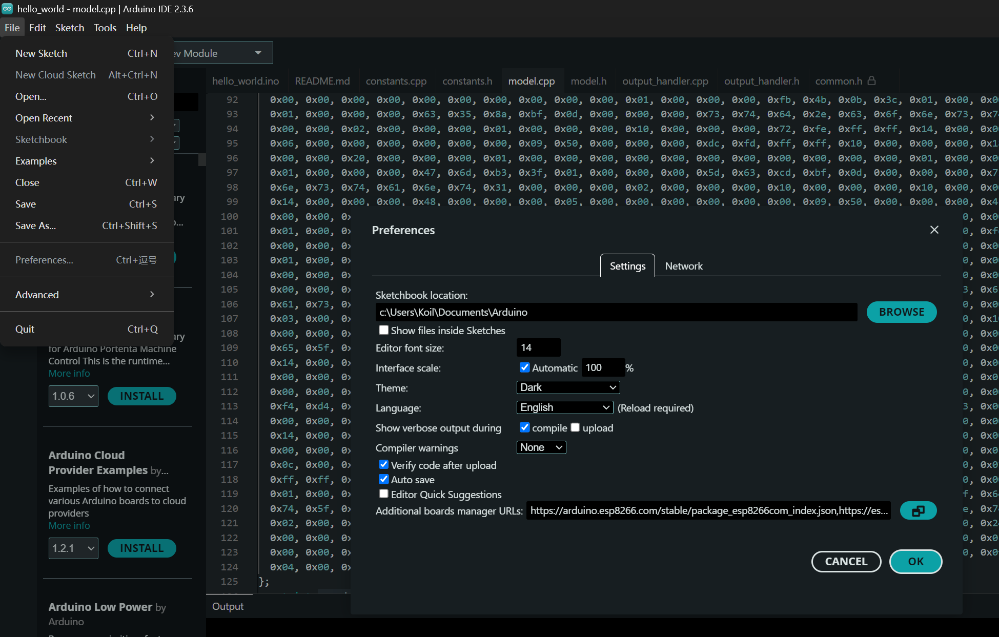
*Windows: Preferences dialog*

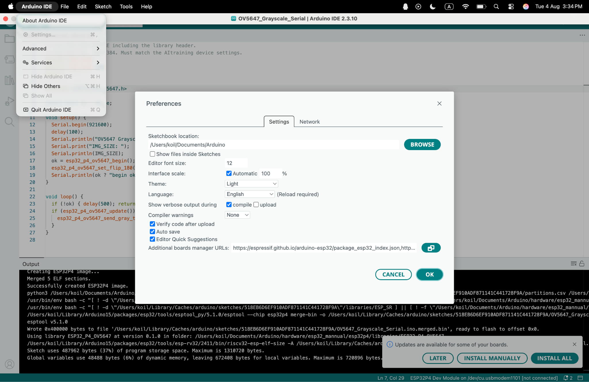
*macOS: Settings dialog*

**Step 3.** Add the ESP32 board index URL and click **OK**:

```
https://dl.espressif.com/dl/package_esp32_index.json
```

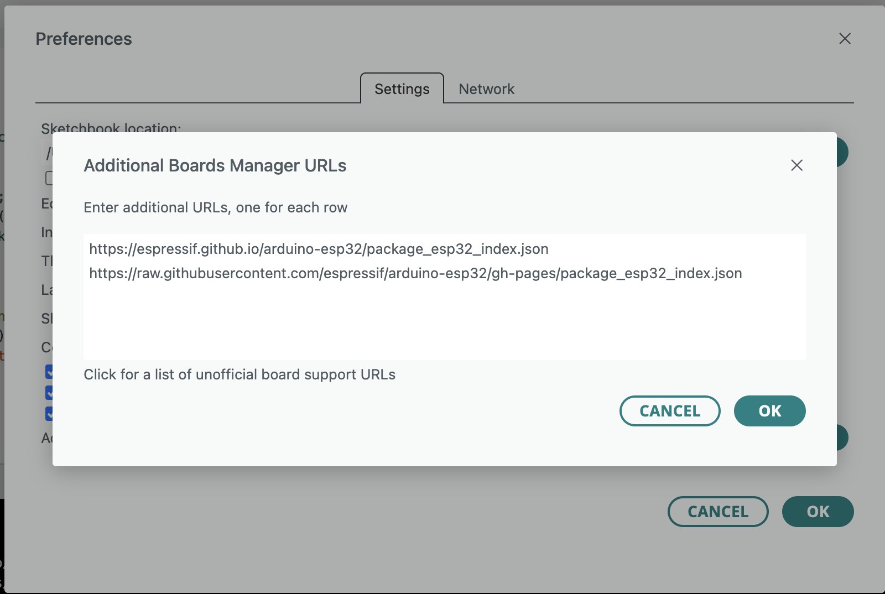
*Paste the URL into "Additional Boards Manager URLs"*

**Step 4.** Go to *Tools → Board → Board Manager*, search **esp32**, install **"esp32 by Espressif Systems"**, and select **version 3.3.1** exactly.

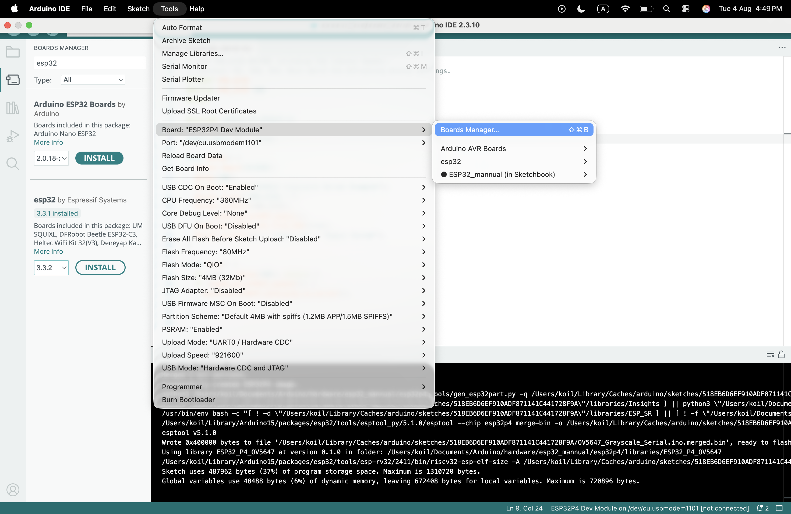
*Board Manager: install esp32 by Espressif Systems, version 3.3.1*

**Step 5.** Unzip the provided **`esp32_mannual.zip`** and place the folder into your Arduino hardware path:

- **macOS:** `/Users/<you>/Documents/Arduino/hardware/`
- **Windows:** `C:\Users\<you>\Documents\Arduino\hardware\`

The final path should be: `/Users/<you>/Documents/Arduino/hardware/esp32_mannual`

**Step 6.** Back in the IDE: *Tools → Board → ESP32_mannual* → select **ESP32P4 Dev Module**, and copy the board settings shown in the manual **one by one** (do not set the "Port" at this stage):

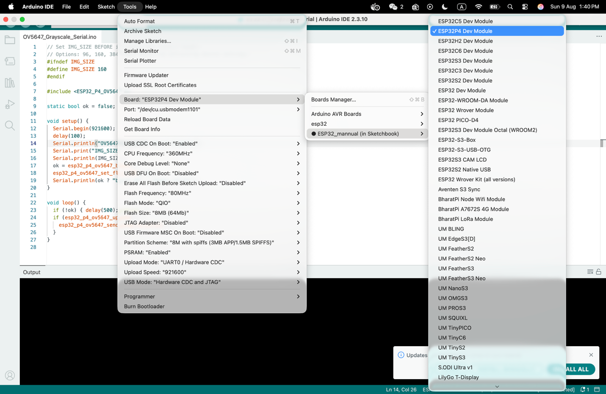
*Copy the board variable settings one by one*

**Step 7.** Now choose the **Port** that connects to your board:

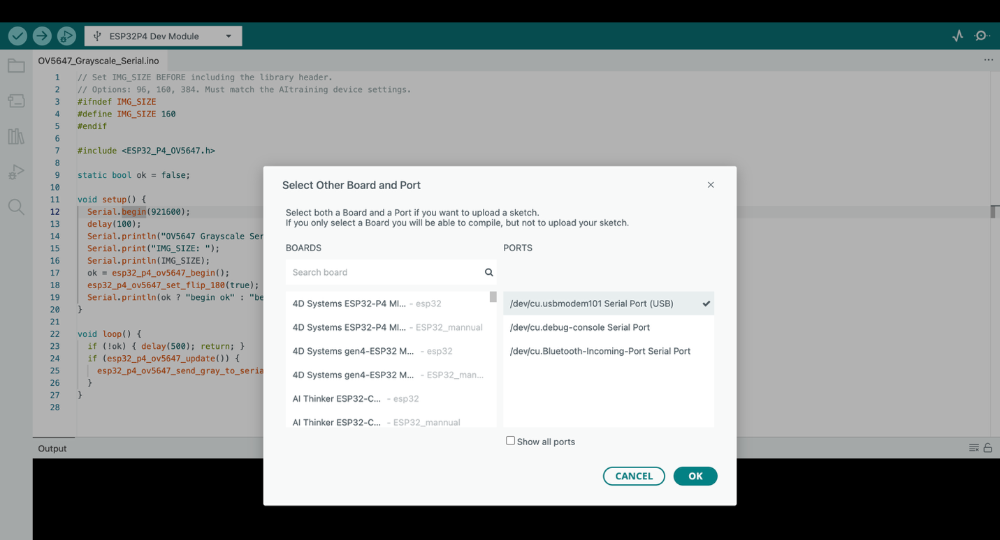
*Select the port your board is connected to*

**Step 8.** Open and **upload the sample code** (it streams grayscale images from the camera over serial):

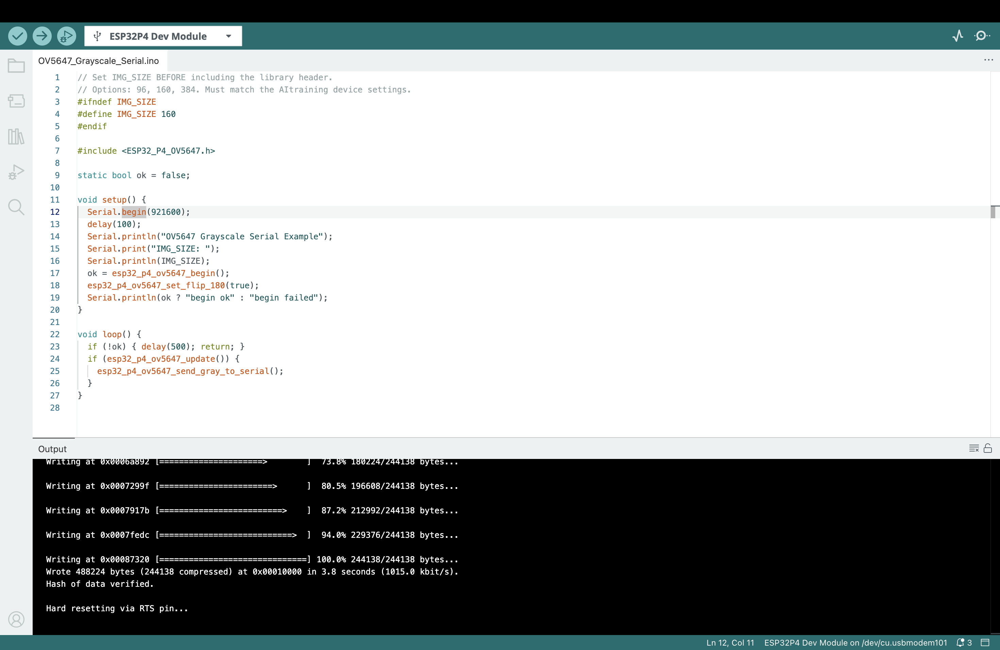
*Click Upload and wait for success*

**Step 9.** Open the **Serial Monitor**. A continuous stream of garbled characters is the binary image data; it indicates a successful upload. Then **close the Serial Monitor** — it occupies the port, which the TFLiteTraining application requires later.

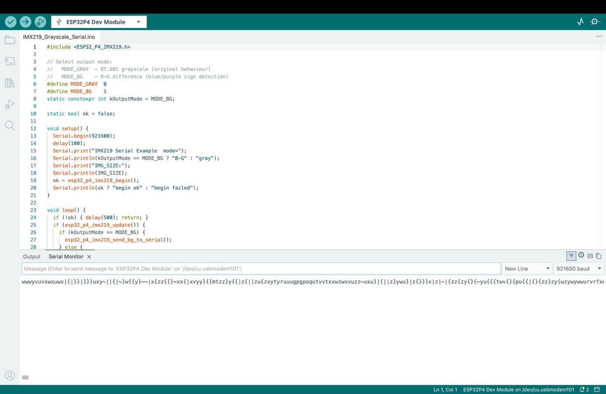
*Garbled characters = the grayscale image stream — the upload succeeded*

### Check Point

Show the TA / instructor: the sample code uploaded successfully, and the image stream visible in the Serial Monitor — then closed.

---

## 4. Task 2 — The TFLiteTraining App

### 4.1 Install and Open the Project

**Step 1.** Install the application from the provided `.dmg` (macOS) or `.exe` (Windows), and download the template project file **`template.tmproj`**.

**Step 2.** Open the application, click **Open Project**, and select `template.tmproj`:

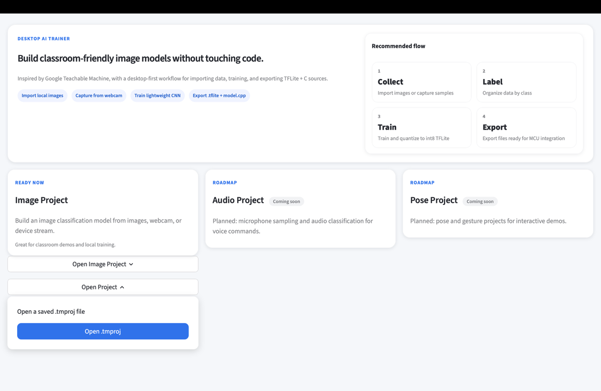
*Open Project → template.tmproj*

### 4.2 The Three Areas of the Workspace

The workspace is divided into three areas:

| Area | Purpose |
| ---- | ------- |
| **Sample Area** | Collect and preprocess the data (images) |
| **Train Area** | Control training via hyperparameters |
| **Preview Area** | Preview the model's live performance |


*Sample Area, Train Area, and Preview Area*

### 4.3 Collecting Samples

There are three ways to collect images:

- **Webcam** — uses the laptop's (or an external) camera; a specific camera can be selected with the **Gear** icon
- **Upload** — chooses picture files from the computer
- **Device** — captures images directly from the **ESP32-P4's serial camera**

For **Device** input: click **Device**, select the board's serial port, and check the **Gear** settings. The defaults — **96×96, Grayscale, 115200 baud, sync header AA 55 AA** — match the sample code flashed in Task 1. Do not change them in this lab.

Capturing: click **Capture** for a single picture, or press-and-hold **Hold to Capture** for a continuous stream.


*Sample collection — capture single images or hold to capture continuously*

**Classes:** each category (for example "left arrow", "right arrow", "wall") is a **class**. Add classes with the + button, rename by clicking the name, delete with the × button. Keep a **similar number of samples in each class** (for example 30–50 each).

**Deleting a sample:** hover over any sampled image and click to delete it.

### 4.4 Preprocessing — Making Cleaner Data

Data quality matters more than model complexity. Enter the image-processing page by clicking the **Edit** icon. The page has two parts: the **Image Viewer** (left) and the **Sample Worktable** (right).


*Image Viewer (original + processed) and the Sample Worktable*

Key concepts:

- **ROI (Region of Interest)** — the purple rectangle marking the area that will be **cropped** and used for training; everything outside is discarded
- **Dark Thr (Darkness Threshold)** — pixels **darker** than this value become pure white
- **Lum Thr (Luminosity Threshold)** — pixels **brighter** than this value become pure white

These two thresholds remove environmental noise — background that is much darker or brighter than the subject disappears.

| Parameter | Effect |
| --------- | ------ |
| **Preprocess Mode** | **Auto** — a search box in the middle finds and crops the darkest area automatically. **Manual ROI** — the crop region is dragged manually on the original image. |
| **Dark Thr** | Pixels below this brightness → white. Global setting for the whole class. |
| **Lum Thr** | Pixels above this brightness → white. Global setting for the whole class. |
| **ROI x1, y1, x2, y2** | Relative coordinates of the crop's top-left (x1, y1) and bottom-right (x2, y2) corners. For example, x1 = 0.2, y1 = 0.1 on a 96×96 image → pixel (19, 10), rounded to the nearest integer. (Manual ROI mode only.) |

All processed images are **resized to image size × image size** (set in the Train Area) before training.

**Keyboard shortcuts in the edit page:**

| Key | Action |
| --- | ------ |
| Arrow keys | Move between samples |
| Shift + Arrow keys | Move the ROI (Manual ROI mode) |
| F1 | Switch to **Auto** preprocess mode |
| F2 | Switch to **Manual ROI** mode |
| D | Delete the current sample |
| S | **Save changes** |
| ESC | Exit the edit view |

> **Save after every change** — unsaved preprocessing is lost.

### 4.5 Hyperparameters

Open the hyperparameter panel with the **Advanced** icon in the Train Area:

| # | Hyperparameter | Default | Range | What it does |
| - | -------------- | ------- | ----- | ------------ |
| 1 | **Image size** | 96 | 96, 160, 384 | Input resolution. Larger = more detail, but slower training and inference. Must match the input size in the Preview Area. |
| 2 | **Color mode** | grayscale | rgb / grayscale | Input channels (1 or 3). Always use **grayscale** for the B-G / G-channel pipeline. |
| 3 | **Batch size** | 16 | 8 / 16 / 32 / 64 | Samples per training step. Larger = faster but more RAM. 16 is suitable for 96×96. |
| 4 | **Epochs** | 20 | 1–200 | Full passes through the dataset. More = better fit, but risks **overfitting** (memorizing instead of learning). |
| 5 | **Validation split** | 0.25 | 0.05–0.50 | Fraction of samples held out to check the model. 0.25 = 75% train, 25% validate. |
| 6 | **Learning rate** | 0.001 | 0.00001–0.1 | Step size of each weight update. Higher = faster but unstable. 0.001 is a safe default. |
| 7 | **Conv1 filters** | 8 | 4 / 8 / 16 / 32 | Feature detectors in the first convolution layer. More = better patterns, bigger model. |
| 8 | **Conv2 filters** | 16 | 8 / 16 / 32 / 64 | Feature detectors in the second convolution layer. Typically 2× Conv1. |
| 9 | **Dense units** | 32 | 16 / 32 / 64 / 128 | Neurons in the fully-connected layer. More = more complex decision boundaries. |


*The Advanced panel: set hyperparameters, then click "Train Embedded Model"*

> **The trade-off:** larger filters, more dense units, and a larger image size *may* improve accuracy — but they **always** make inference slower. Edge-AI engineering consists of finding the balance that preserves real-time performance.

### 4.6 Training

After setting the hyperparameters, click **Train Embedded Model** and wait for training to complete. Monitor the **validation accuracy**: a high validation accuracy together with poor live performance indicates overfitting or insufficient sample variety — recapture samples in different lighting and at different angles.

### 4.7 Preview — Live Testing

Before previewing, confirm that the image-uploading code from Task 1 is still flashed on the board.

**Step 1.** Click the **Gear** icon in the Preview Area, set the input source to **Device**, and choose the port. (The "export" setting is irrelevant here.) All preview images are resized to *image size × image size* in grayscale, exactly as in training.

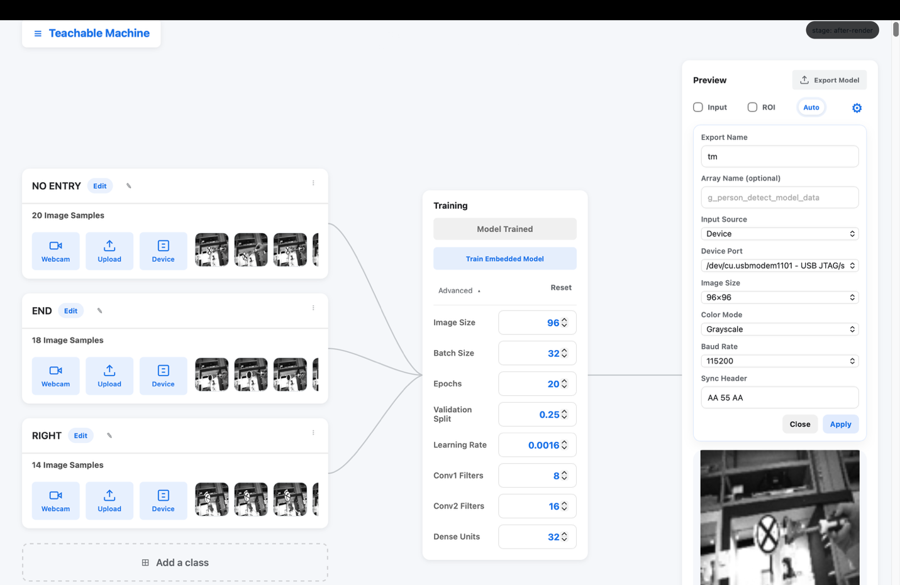
*Set source to Device and choose the port*

**Step 2.** Toggle **Input** to see the live image, and read the **confidence bar** at the bottom — switch between **show %** and **show score** to change its units. Toggle **ROI** to see exactly what the model receives, or **Orig** to see the processed image. The **Dark/Lum thresholds** can also be adjusted here, with the effect visible live.


*Interpretation view: live image, ROI, and the confidence bar*

### 4.8 Export and Save

When the model performs satisfactorily, click **Export model**, and save the project via the top-left menu → **Save Project**.

### Check Point

Show the TA / instructor: a trained model with at least two classes, live preview recognizing the objects, and the exported model files.

---

## 5. Task 3 — Deploy the Model on the MCU

With the model trained, the final step is running it on the chip.

**Step 1.** Open the folder where the model was exported, and the project folder containing **`TFLite.ino`**.

**Step 2.** Copy these **five files** from the export folder into the project folder (replacing the existing versions):

- `tm_model_data.cpp` — the quantized model weights
- `tm_model_data.h`
- `model_resolver.h`
- `model_settings.cpp`
- `model_settings.h`


*The five export files, copied into the TFLite.ino project*

**Step 3.** Open `TFLite.ino` and confirm that **`IMG_SIZE` matches the "image size"** chosen in the TFLiteTraining application (default: 96). A mismatch supplies wrongly sized images to the model and produces meaningless output.

**Step 4.** Upload the code, open the Serial Monitor, and observe the model classifying the live camera stream:

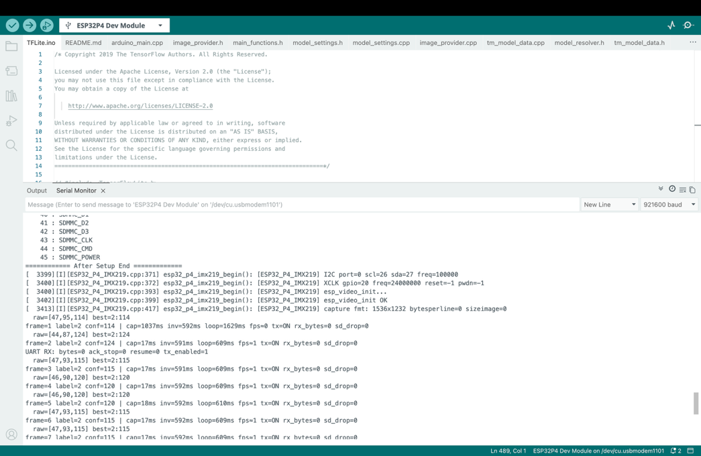
*The model running on the ESP32-P4 — live inference output*

### Check Point

Show the TA / instructor: the model running on the ESP32-P4, classifying live camera images with sensible confidences.

---

## 6. Appendix — Suggested Experiments

- **Epochs:** train with 5, 20, and 60 epochs — observe the validation accuracy and determine the point at which further training stops helping
- **Model size:** set Conv1/Conv2 filters and Dense units to the minimum and then to the maximum — compare accuracy **and** the update rate of the serial output
- **Data quality:** train once with messy backgrounds and once with strict Dark/Lum thresholds — determine which matters more: cleaner data or a larger model
- **Image size:** compare 96 and 160 — measure the difference in inference speed

These are the same trade-offs faced in professional edge-AI engineering.
