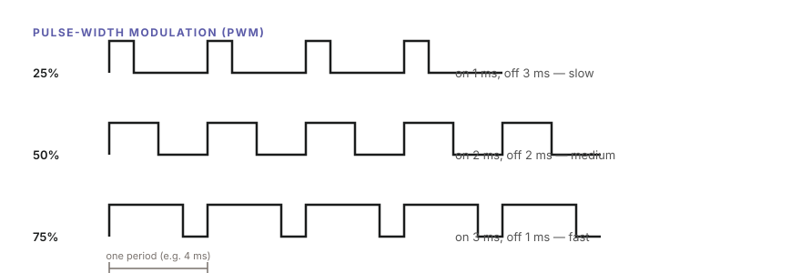
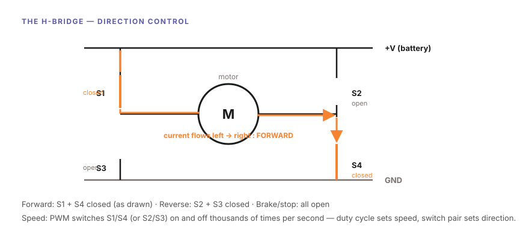
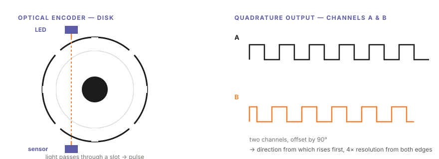
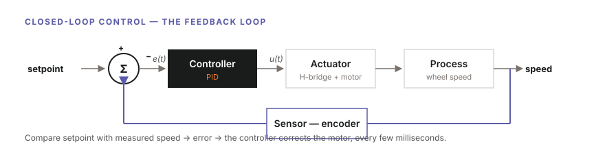
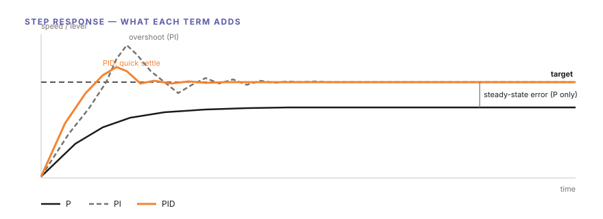

# Lab 1 — Motor & Motion: Making Movement Reliable *(Student Guide)*

> Adapted from AIoScout curriculum material and HKUST ISDN 2601 lecture notes (Robot Sensing; PID Controller) for secondary school students.
>
> **Lab focus** — drive the motors, measure motion with encoders, and close the loop with PID control until the car holds a straight line on its own.

---

## 1. Welcome — What You Will Learn

This is the lab where the car first moves — and then learns to move *accurately*. By the end you can:

- Explain how a **DC motor** turns voltage into rotation, and how **PWM** sets the speed
- Use an **H-bridge** to control direction
- Read a wheel **encoder** and convert pulses into real distance and speed
- Explain **open-loop** vs **closed-loop** control, and why feedback matters
- Build and tune a **PID controller** that holds both wheels at the same speed

**Key words you will learn:** motor · PWM · duty cycle · H-bridge · encoder · quadrature · counts per revolution · feedback · error · P, I, D · steady-state error · overshoot · tuning

---

## 2. Background — From Voltage to Trustworthy Motion

### 2.1 The DC Motor

A **DC motor** is simplicity itself: apply a DC voltage and it rotates; remove the voltage and it stops. Inside, current flowing through a coil in a magnetic field creates a force that spins the shaft. More voltage → faster spin. That's the whole principle — the tricky parts are *how fast* (speed control) and *which way* (direction control).

### 2.2 Speed Control by PWM

We can't give a motor "half a voltage" cleanly — but we can give it full voltage **half the time**. **Pulse-Width Modulation (PWM)** switches the motor on and off thousands of times per second; the fraction of time it stays on — the **duty cycle** — sets the average power, and therefore the speed:


*Same voltage, different ON-time: 25%, 50%, 75% duty → slow, medium, fast*

### 2.3 Direction Control: the H-Bridge

To reverse a DC motor you must reverse the current through it. An **H-bridge** is four electronic switches arranged around the motor (drawn like the letter H):

- Close **S1 + S4** → current flows left-to-right → **forward**
- Close **S2 + S3** → current flows right-to-left → **reverse**
- All open → **stop** (or brake)


*Forward state drawn: S1 and S4 closed, current (orange) flows through the motor*

Combine the two ideas: the switch pair sets **direction**, PWM on the pair sets **speed**. This is exactly what the motor driver chip on the car does for you.

### 2.4 Measuring Motion: the Encoder

Motors are blind — they don't know how far they've turned. An **encoder** tells us. In the human-body analogy from the lectures, encoders are the robot's **proprioception**: the sense your muscles and joints use to know where your limbs are without looking.

An **optical encoder** has three parts:

1. A **light source** (an LED, its beam made parallel by a lens)
2. An opaque **code disk** on the shaft with slots around its rim
3. A **photosensor** (photodiode or phototransistor) that detects the light

As the wheel turns, the disk chops the light beam into **pulses** — count the pulses and you know the rotation:


*Left: LED, slotted disk, and sensor. Right: channels A and B offset by 90°*

**Quadrature.** Good encoders output *two* signals, **A and B**, offset by a quarter cycle (90°). This gives two gifts:

- **Direction** — if A rises before B, the wheel turns one way; if B rises first, the other way
- **4× the resolution** — counting the rising *and* falling edges of both channels gives four counts per slot

**Resolution.** For a disk with N slots, one count is 360/N degrees. Counting both edges makes it 360/2N, and full quadrature makes it **360/4N**. Absolute encoders (which read position directly from a coded disk, e.g. in **Gray code**, where only one bit flips per step so misreads can't jump far) achieve 360/2ⁿ with n tracks — more accurate, but more expensive. Our car uses **incremental quadrature encoders**.

**From counts to distance.** The encoder gives counts; physics converts them:

```
revolutions = counts / CPR          (CPR = counts per revolution, after quadrature)
distance    = revolutions × wheel circumference
speed       = distance / elapsed time
```

Example: a 65 mm wheel (circumference ≈ 204 mm) with CPR = 360: 720 counts = 2 revolutions = **408 mm** travelled.

### 2.5 Open Loop vs. Closed Loop

Send the same PWM to both motors and the car will **curve**. Why? No two motors are identical — different friction, different windings — so "50% duty" never means the same speed twice. This is **open-loop control**: input → process → output, no measurement, no correction. It's walking with your eyes closed.

**Closed-loop control** adds feedback: measure the output, compare it with the target, and correct the difference. The lecture's cruise-control example: without feedback, the car slows on every uphill; with a speed sensor feeding back, the controller adds power the moment speed drops.


*The feedback loop: sensor (encoder) → error → controller (PID) → actuator (H-bridge + motor) → wheel speed*

Every control system has the same four parts — in the air conditioner, the process is room temperature and the actuator is the compressor; in our car, the process is wheel speed and the actuator is the H-bridge and motor.

### 2.6 PID: the Classic Controller

In 1936, Callender and Stevenson patented the combination that still runs over 90% of industrial controllers today: **P**roportional-**I**ntegral-**D**erivative. The controller output is:

$$
u(t) = K_p\left[\, e(t) + \frac{1}{T_i}\int_0^t e(\tau)\,d\tau + T_d \frac{de(t)}{dt} \,\right]
$$

where **e(t)** is the error (target − measured) and the three terms each play a role. The lectures explain them with a **leaking water tank** — you want the water at level A, but it keeps draining to level B:

**P — Proportional: react to the present.**
The tap opens in proportion to how far the level is below target. Big difference → big correction. But with a *leak*, a proportional-only controller settles where its correction exactly balances the leak — **below the target, forever**. That residual gap is the **steady-state error**: with P alone, the water stays at 1 dm while the target is 2.

**I — Integral: remember the past.**
The integral accumulates error over time. As long as the level is below target, the accumulated error grows, and the tap opens further — until the steady-state error is gone. The cost: the response now **overshoots** (the accumulated "momentum" pushes past the target) and settles more slowly.

**D — Derivative: anticipate the future.**
The derivative reacts to how *fast* the error is changing — it brakes the correction when the level rises quickly, cutting the **overshoot** and shortening the settle time. In cruise control: on an uphill the speed derivative is negative → add power *early*; on a downhill it's positive → brake *early*.


*What each term adds: P leaves a steady-state error; I removes it at the cost of overshoot; D calms the response*

**The control loop in pseudocode** (run every few milliseconds):

```text
take a new measurement            (encoder speed)
error     = target − measured
integral  = integral + error × dt          (sum of all past errors)
derivative = (error − lastError) / dt      (how fast it's changing)
output    = Kp×error + Ki×integral + Kd×derivative
lastError = error
drive the motor with output
```

---

## 3. Task 1 — First Motion (Open Loop)

**Step 1.** Set up the car as in previous labs (battery, board settings, port).

**Step 2.** Open `Task_1.ino` and find the motor commands — set both wheels to the same PWM value (e.g. 1000) and upload.

**Step 3.** Place the car on the floor (or hold it over the table with wheels free) and let it run 2 metres. Mark where it ends.

**Step 4.** Repeat three times from the same start line.

**Observation to record:** with identical commands, does the car run straight? How far from the straight line does it drift? Where does it end up each run — the same place?

### 🏁 Check Point

Show the TA / instructor: the car moving under open loop, and your three drift measurements. Explain why identical commands don't give identical motion.

---

## 4. Task 2 — Reading the Encoders

**Step 1.** Open `Task_2.ino`. The encoder channel A pins are wired to interrupt-capable GPIOs; the skeleton attaches an **interrupt service routine** that counts pulses:

```cpp
volatile long countL = 0, countR = 0;

void IRAM_ATTR isrEncoderLeft()  { countL++; }   // +1 per edge, channel A
void IRAM_ATTR isrEncoderRight() { countR++; }

void setup() {
  Serial.begin(115200);
  attachInterrupt(digitalPinToInterrupt(ENC_L_A), isrEncoderLeft,  RISING);
  attachInterrupt(digitalPinToInterrupt(ENC_R_A), isrEncoderRight, RISING);
}
```

**Step 2.** Upload, open the Serial Monitor, and spin the wheels by hand — watch the counts climb.

**Step 3.** Push the car exactly **1 metre** along a tape measure in a straight line. Record the counts for each wheel.

**Step 4.** Compute your conversion factor — counts per metre:

```
counts_per_metre = counts / 1.00 m
```

and check it against theory: `counts_per_metre = CPR / wheel_circumference`. (Your instructor gives you the CPR and wheel diameter for the car.)

**Step 5.** Add speed measurement: every `dt = 100 ms`, read the counts, compute how far the wheel travelled, and print speed in m/s:

```cpp
float distance = (countL - lastCountL) / (float)CPR * WHEEL_CIRC;  // metres this interval
float speed    = distance / dt;                                    // m/s
```

### 🏁 Check Point

Show the TA: hand-spun counts, your measured counts-per-metre vs. the theoretical value, and live speed readouts while pushing the car.

---

## 5. Task 3 — Closing the Loop: P, I, D

Now the centrepiece. `Task_3.ino` runs a control loop every 10 ms: read both encoders, compute each wheel's speed, compare with the target, and write the PWM.

**Step 1 — P only.** Set `Ki = 0`, `Kd = 0`, `Kp = 1.0`. Command a target speed to both wheels.

```cpp
float Kp = 1.0, Ki = 0.0, Kd = 0.0;

void controlLoop(float target) {
  float measured = readSpeedLeft();            // m/s, from Task 2
  float error    = target - measured;
  integral      += error * dt;
  float deriv    = (error - lastError) / dt;
  float u        = Kp*error + Ki*integral + Kd*deriv;
  lastError      = error;
  motorLeftWrite(constrain(u, 0, MAX_PWM));    // clamp to valid PWM range
}
```

Record what happens: does the wheel reach the target speed? Watch the printed speed settle **below** the target — the leaking-tank story in your motor: friction and load are the leak. That gap is the **steady-state error**.

**Step 2 — Add I.** Set `Ki = 0.05`. Watch the steady-state error shrink to zero — then notice the overshoot as it approaches.

**Step 3 — Add D.** Set `Kd = 1.0`. Watch the overshoot shrink and the speed settle faster.

**Step 4 — Tune it** (the lecture's trial-and-error recipe):

1. Disable I and D; adjust **P** until the response is nearly stable — start at 1.0, adjust by ±0.5, fine-tune by ±0.1
2. Enable **I** until the steady state matches the setpoint — start at 0.05, adjust by ±0.01, fine-tune by ±0.005
3. Enable **D** until oscillation is reduced to your satisfaction — start at 1.0, adjust by ±0.5, fine-tune by ±0.1

Change **one constant at a time**, and write down each setting with what you observed — that log is your tuning evidence.

### 🏁 Check Point

Show the TA: the same target speed on both wheels with your tuned constants — and your tuning log with at least three tested settings.

---

## 6. Task 4 — The Straight-Line Test (Milestone)

**Step 1.** With your tuned PID controlling both wheels to the same target speed, place the car on a 2-metre start line.

**Step 2.** Run it — three times.

**Step 3.** Measure the lateral deviation from the straight line at the 2 m mark for each run.

**Success criteria:** deviation under **5 cm**, reproducible across three runs.

Compare with your Task 1 measurements: same car, same motors — but now the feedback loop corrects every difference between the wheels, dozens of times per second.

### 🏁 Check Point

Show the TA: three straight-line runs and your deviation table. This is the Part 1 milestone — *The Perfectly Straight Line*.

---

## 7. Appendix

### 7.1 Why the car turns: differential drive

Two driven wheels, one castor. The car's speed and turn rate come straight from the wheel speeds:

```
v = (vL + vR) / 2          (forward speed)
ω = (vR − vL) / W          (turn rate; W = distance between wheels)
```

Equal speeds → straight. A small difference → a gentle arc. Opposite speeds → pivot on the spot. PID holding `vL = vR` is what makes "straight" happen.

### 7.2 Encoder quirks worth knowing

- **Missed counts:** if the interrupt fires faster than the MCU can service it, counts are lost — one reason to keep control loops lean
- **Gray code:** absolute encoder disks use Gray code so that only one bit changes per step — a misread then moves the position by one step, not to a wildly wrong angle (the binary-code problem from the lecture)
- **Real errors:** quantization, disk eccentricity, printing tolerances, vibration — why your measured counts-per-metre and the theoretical value differ slightly

### 7.3 Troubleshooting

| Symptom | Likely cause |
| ------- | ------------ |
| One wheel never moves | Motor connector or H-bridge wiring — swap left/right connectors to isolate |
| Counts don't change | Encoder power or signal pin; check attachInterrupt used an interrupt-capable pin |
| Counts jitter while still | Ambient light or loose sensor — shade the disk; check wiring |
| Speed oscillates wildly | Kp too high — halve it, then re-tune in order P → I → D |
| Never reaches target | Ki too small, or the target speed exceeds what the motor can deliver at full PWM |
