# Lab 2 — Sensors: Teaching a Robot to "See" and "Feel" *(Student Guide)*

> Adapted from HKUST ISDN 2602 (Spring 2025) Laboratory 2 for secondary school students.
>
> **Original course info** — GitHub Classroom: https://classroom.github.com/a/67yXOYYA · Deadline: 23:59, 1 Oct 2025

---

## 1. Welcome — What You Will Learn

In this lab you will work with a **small robotic car**. By the end you will be able to:

- 🧠 Understand what a **microcontroller (ESP32)** is — the "brain" of the car
- 💻 Use the **Arduino IDE** to write and upload code to the car
- 📏 Measure distance with an **ultrasonic sensor** (like a bat!)
- 🌀 Read motion with an **Inertial Measurement Unit (IMU)**
- 🧹 Clean up noisy sensor data with **filters**

**Key words you will learn:** microcontroller · sensor · ultrasonic · echo · accelerometer · gyroscope · noise · filter · sensor fusion

---

## 2. Background — Everything You Need to Know First

### 2.1 Meet Your Robot Car

Here is the car you will use. It has wheels, motors, sensors, and one important chip in the middle — the microcontroller.

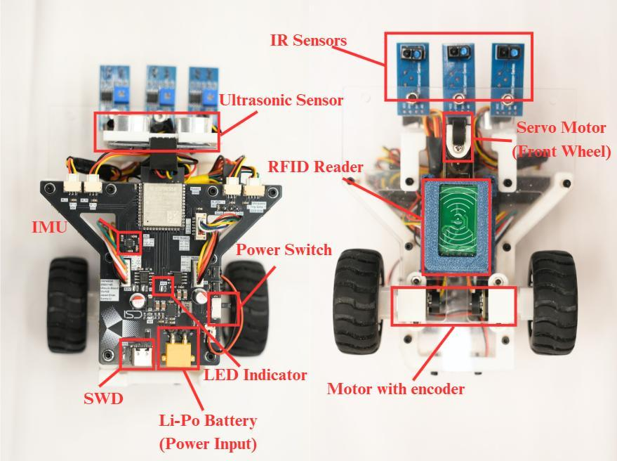
*The composition of the robotic car*

And here is the box of materials for Tasks 1 and 2 (ultrasonic sensor, IMU board, cables, and the car chassis):

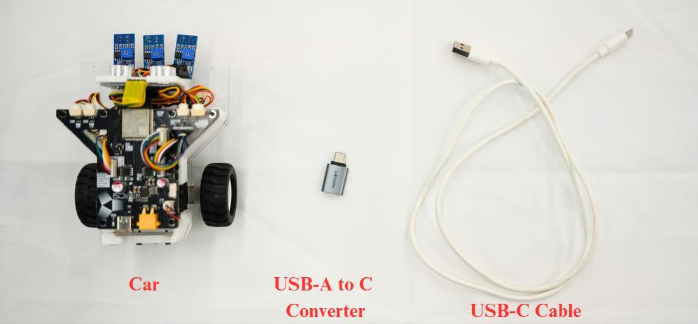
*Materials for Tasks 1 & 2*

### 2.2 What Is a Microcontroller? (The "Brain")

A **microcontroller** is a tiny, complete computer on a single chip. It is much weaker than your laptop, but it is:

- **Cheap** and **small** — it fits on your palm
- **Great at reading sensors and controlling motors**
- **Very power-efficient** — it can run on a small battery

Our car uses the **ESP32-S3**, made by Espressif. Despite being smaller than a coin, it has:

- A processor running at 240 MHz (fast enough to run your code thousands of times per second)
- **Wi-Fi** and **Bluetooth** built in (we will use Wi-Fi in a later lab!)
- Many **GPIO pins** — the metal legs of the chip that can read signals from sensors or send signals to motors

Think of the ESP32 as the brain, the sensors as the eyes and ears, and the motors as the muscles.

### 2.3 What Is the Arduino IDE?

**IDE** stands for *Integrated Development Environment* — the app where you write code. The **Arduino IDE** lets you:

1. Write a **sketch** (that's what Arduino programs are called) in the C++ language
2. Check it for errors (called **compile**)
3. **Upload** it to the ESP32 through a USB cable

Every Arduino sketch has two essential parts:

```cpp
void setup() {
  // Runs ONCE when the board powers up — good for initial settings
}

void loop() {
  // Runs FOREVER, over and over, like a spinning record — good for reading sensors
}
```

### 2.4 What Is a Sensor?

A **sensor** converts something from the real world (distance, motion, light, temperature...) into an electrical signal the microcontroller can read. Important truth about sensors:

> ⚠️ **No sensor is perfect.** Real sensor data is always a bit "shaky" — we call the random shakiness **noise**. In this lab you will learn a professional trick (filtering) to clean it up.

You will use two sensors today: the **ultrasonic sensor** (measures distance) and the **IMU** (measures motion).

---

## 3. Setting Up the Arduino IDE (Do This Before Any Task!)

The ESP32-S3 board on the car is **not** in Arduino's default board library, so we must configure the settings carefully. If you skip this, the serial port and the flash memory may not work properly. Follow these steps exactly:

**Step 1.** Open the Arduino IDE. Go to `Tools → Board → esp32` and choose **"ESP32S3 Dev Module"**.

**Step 2.** Then, still under the `Tools` menu, set every option to match this table:

| Setting                              | Value                       |
| ------------------------------------ | --------------------------- |
| USB CDC On Boot                      | Enabled                     |
| CPU Frequency                        | 240MHz (WiFi)               |
| Core Debug Level                     | None                        |
| USB DFU On Boot                      | Disabled                    |
| Erase All Flash Before Sketch Upload | Disabled                    |
| Events Run On                        | 1                           |
| Flash Mode                           | QIO 80MHz                   |
| Flash Size                           | 8MB (64Mb)                  |
| JTAG Adapter                         | Disabled                    |
| Arduino Runs On                      | 1                           |
| USB Firmware MSC On Boot             | Disabled                    |
| Partition Scheme                     | No OTA (2MB APP/2MB SPIFFS) |
| PSRAM                                | Disabled                    |
| Upload Mode                          | USB-OTG CDC (TinyUSB)       |
| Upload Speed                         | 921600                      |
| USB Mode                             | Hardware CDC and JTAG       |
| Zigbee Mode                          | Disabled                    |

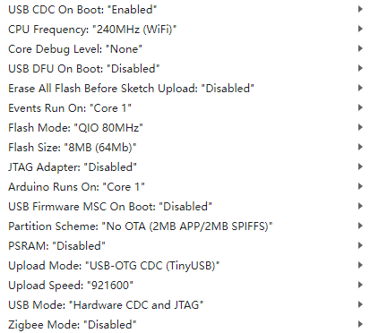
*What the Tools menu should look like when everything is set correctly*

**Step 3.** Connect the car with the USB cable. Under `Tools → Port`, select the port that appears.

✅ **Quick check:** if you can see a port appear after plugging in the USB cable, your settings are very likely correct.

---

## 4. Task 1 — Ultrasonic Sensor: Measuring Distance with Sound

### 4.1 Background: How Bats Find Their Way

Bats can't see well, so they **shout** very high-pitched sounds and **listen for the echo** that bounces back from obstacles. If the echo comes back quickly, the obstacle is close. If it comes back slowly, the obstacle is far.

Our sensor, the **HC-SR04 ultrasonic sensor**, does exactly the same thing:

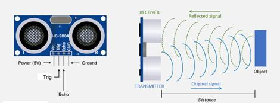
*How the ultrasonic sensor works: send a sound pulse, wait for the echo*

Here is the full workflow:

1. **Transmission** — the sensor's transmitter emits ultrasonic sound waves (above 20 kHz — too high-pitched for human ears to hear).
2. **Propagation** — the sound waves travel through the air toward the target object.
3. **Reflection** — when the waves hit an object, they bounce back.
4. **Reception** — the sensor's receiver detects the reflected waves (the *echo*).
5. **Time measurement** — the sensor measures the time between sending the sound and hearing the echo.
6. **Distance calculation** — using the speed of sound, the distance is:

$$
Distance=\frac{Speed\ of\ sound \times Time\ interval}{2}
$$

7. **Output** — the distance value is sent to the microcontroller, which can use it for obstacle avoidance, object detection, and so on.

**Why divide by 2?** 🤔 Because the sound travels to the object **and back again** — twice the distance! To get the one-way distance, we divide by 2.

**Speed of sound:** approximately **343 m/s** in air at room temperature.

**Worked example:** suppose the echo comes back after 588 microseconds (µs).
Time = 588 µs = 0.000588 s → Distance = (343 × 0.000588) / 2 ≈ **0.1 m = 10 cm**.

### 4.2 Wiring — The PCB Pinout

The ultrasonic sensor is connected to the car's PCB (printed circuit board). This diagram shows which pins carry the **trigger** (send) and **echo** (receive) signals:

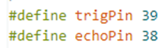
*Pinout of the PCB for the ultrasonic sensor — check which GPIO pins are used for Trig and Echo*

### 4.3 Step-by-Step Instructions

**Step 1 — Open the code.**
Open the file `Task_1.ino` in the Arduino IDE (in the lab folder you downloaded).

**Step 2 — Check the pin definitions.** They should match the pinout above:

```cpp
#define trigPin 39   // GPIO pin that SENDS the ultrasonic pulse
#define echoPin 38   // GPIO pin that WAITS for the echo to come back
```

**Step 3 — Define the speed of sound** (in m/s):

```cpp
#define SOUND_SPEED 343   // speed of sound in air, in metres per second
```

**Step 4 — Modify the distance equation** so it uses the speed of sound correctly:

```cpp
distance = (duration * SOUND_SPEED) / 2;   // duration in seconds → distance in metres
```

Remember: divide by 2 because the sound travels there **and back**.

**Step 5 — Upload.** Click the **Upload** button (→ arrow) in the Arduino IDE and wait for "Upload complete".

**Step 6 — Open the Serial Monitor.** Click the magnifying-glass button (top right) and set the speed (baud rate) to **115200**. You should see distance values printing once per second:

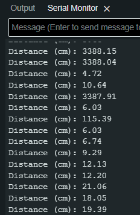
*Expected result: the Serial Monitor printing distance values*

**Step 7 — Test the accuracy.** Point the sensor at a wall or a box and compare the printed value with a ruler measurement. Are they close?

**Step 8 — Record your measurements.** Find three objects (or three distances) to measure, and write the values in the table:

| #  | The object you measured | Value |
| -- | ----------------------- | ----- |
| 1  |                         |       |
| 2  |                         |       |
| 3  |                         |       |

### 🏁 Check Point

Commit your code to the GitHub Classroom repository, and **show your result to the TA / instructor**.

### 4.4 Appendix — The Full Example Code, Explained Line by Line

Here is the complete example program. Read the comments to understand every line:

```cpp
#define trigPin 16          // trigger pin (example pin numbers)
#define echoPin 15          // echo pin
#define SOUND_SPEED 340     // speed of sound (m/s)

long duration;   // will store the time the sound wave takes to travel to the obstacle and back (µs)
float distance;  // will store the calculated distance (m)

void setup() {
  Serial.begin(115200);         // start talking to the computer at 115200 baud
  pinMode(trigPin, OUTPUT);     // trigger pin sends signals → OUTPUT
  pinMode(echoPin, INPUT);      // echo pin receives signals → INPUT
  Serial.println("Ultrasonic Sensor is set");
  delay(10);                    // wait 10 ms for things to stabilise
}

void loop() {
  // --- Send a 10 µs ultrasonic pulse ---
  digitalWrite(trigPin, LOW);
  delayMicroseconds(2);         // clear any previous signal
  digitalWrite(trigPin, HIGH);
  delayMicroseconds(10);        // keep the pin HIGH for 10 µs — this is the "shout"
  digitalWrite(trigPin, LOW);   // end the pulse

  // --- Listen for the echo ---
  duration = pulseIn(echoPin, HIGH);            // time (µs) the echo pin stays HIGH

  // --- Calculate distance ---
  distance = (duration * SOUND_SPEED / 100) / 2;  // ÷100 converts µs·(m/s) into cm

  // --- Print the result ---
  Serial.print("Distance (cm): ");
  Serial.println(distance / 100);
  delay(1000);                  // measure once per second
}
```

---

## 5. Task 2 — IMU and 3D Visualization: Feeling Motion

### 5.1 Background: What Is Inside an IMU?

An **IMU (Inertial Measurement Unit)** is the sensor that lets a phone know which way is up, a drone stay level, and a games controller sense your swing. It is really **two (or three) sensors in one chip**:

- **Accelerometer** — measures *linear acceleration* `a` in m/s². Even when sitting still, it senses the pull of **gravity** (≈ 9.81 m/s², pointing toward the centre of the Earth). That's how it knows which way is "down".
- **Gyroscope** — measures *angular velocity* `ω` (how fast you are rotating) in degrees/sec.
- **Magnetometer** (optional) — measures magnetic field strength in µT or Gauss, like a digital compass.

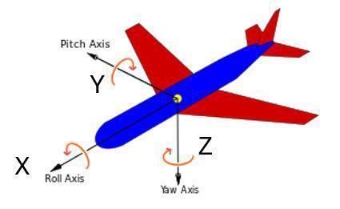
*To track orientation, we need to know the car's rotation around the X, Y and Z axes*

### 5.2 Background: How Do We Get Orientation (Angles)?

We want the car's **roll** (tilting left/right), **pitch** (tilting forward/back) and **yaw** (turning left/right). Each sensor alone can give us an estimate:

**Method 1 — Integrate the gyroscope.** If you know how fast you are rotating and for how long, you can add it up (integrate) to get the angle:

$$
\theta(t)=\theta_{0}+\int_{0}^{t} \omega(\tau)\, d\tau
$$

**Method 2 — Use the accelerometer and gravity.** When the device is still (or moving smoothly), the accelerometer mostly measures gravity. By looking at how gravity splits across the X, Y, Z axes, we can compute the tilt angles:

$$
Roll=\phi=\arctan\!\left(\frac{a_z}{a_y}\right)
$$

$$
Pitch=\theta=\arctan\!\left(-\frac{a_x}{\sqrt{a_y^{2}+a_z^{2}}}\right)
$$

### 5.3 Background: Each Sensor Has a Weakness

| Sensor        | Strengths                  | Weakness                     |
| ------------- | -------------------------- | ---------------------------- |
| Gyroscope     | Fast, smooth, no noise     | **Drifts** over time         |
| Accelerometer | Stable long-term, no drift | **Noisy**, affected by motion |

**Gyroscope drift:** integrating is like adding up small errors again and again — after a minute, the angle slowly "wanders" away from the truth even when the car is standing still.

**Accelerometer noise:** every bump and vibration shakes the reading, but averaged over a long time it points at the true "down".

### 5.4 Background: Filters — Making Two Weak Sensors into One Strong One

**A. Low-Pass Filter (smoothing)**

- **Purpose:** removes high-frequency noise from the accelerometer data.
- **Why it works:** gravity is a *constant* (low-frequency) signal, while noise vibrates *fast* (high-frequency). A low-pass filter keeps the slow part and throws away the fast part — like averaging your quiz scores to see the real trend.
- **Limitation:** filter too much and you introduce lag — the value reacts slowly to real changes.

**How it works, with numbers:** each step, blend the new reading with the previous filtered value:

$$
filtered = \alpha \times new\_reading + (1-\alpha) \times filtered_{old}
$$

*Example:* α = 0.3, old filtered value = 10, new reading = 20 → new filtered value = 0.3 × 20 + 0.7 × 10 = **13**. The value moves smoothly toward the reading instead of jumping.

**B. Complementary Filter (sensor fusion)**

- **Purpose:** combine the *strengths* of both sensors — this is called **sensor fusion**.
- The **gyroscope** handles short-term, fast changes (it's smooth and quick).
- The **accelerometer** handles long-term correction (it doesn't drift, so it pulls the estimate back to the truth).

$$
angle = \alpha \times (\text{gyro estimate}) + (1-\alpha) \times (\text{accelerometer estimate})
$$

Our car's IMU chip is the **ICM-42688-P** (a 6-axis MEMS sensor = accelerometer + gyroscope):


*The ICM-42688-P chip and its X/Y/Z axis orientation*

### 5.5 The Skeleton Code

The lab provides `Task_2.ino` with most of the work done. Below are the important pieces (also shown in the original manual's screenshots).

**Initialization of the ICM-42688-P over I2C** — I2C is a simple 2-wire language that chips use to talk to each other:

```cpp
// I2C IMU instance
ICM42688 IMU(Wire, 0x68, IMU_SDA, IMU_SCL);

void setup() {
  Serial.begin(115200);
  while (!Serial) {}
  int status = IMU.begin();
  if (status < 0) {
    Serial.println("IMU initialization unsuccessful");
    Serial.println("Check IMU wiring or try cycling power");
    Serial.print("Status: ");
    Serial.println(status);
    while (1) {}          // stop here if the IMU is not found
  }
  IMU.setAccelFS(ICM42688::gpm8);        // accelerometer range: ±8 g
  IMU.setGyroFS(ICM42688::dps500);       // gyroscope range: ±500 degrees/sec
  IMU.setAccelODR(ICM42688::odr12_5);    // accelerometer sampling rate
  IMU.setGyroODR(ICM42688::odr12_5);     // gyroscope sampling rate
  Serial.println("---IMU Initialized---");
}
```

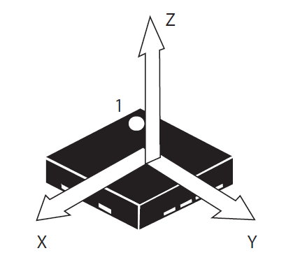
*Initializing the IMU (screenshot from the manual)*

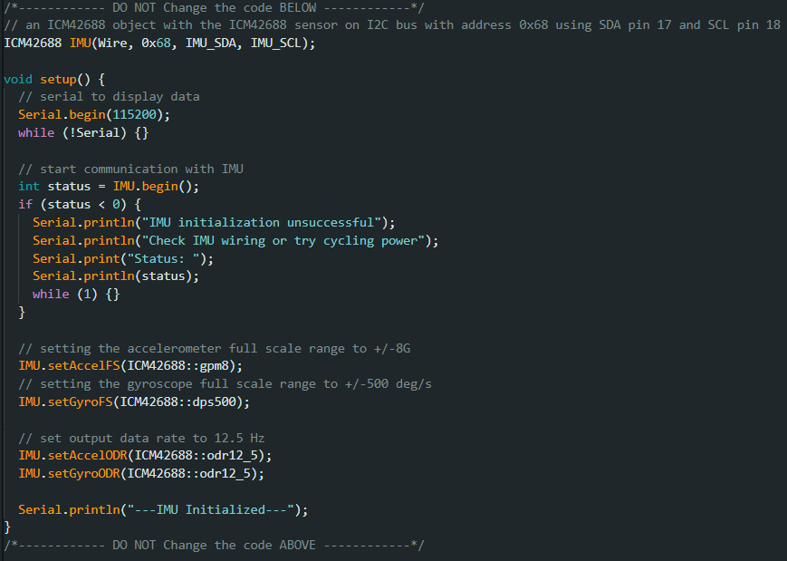
*Reading raw data from the IMU (screenshot from the manual)*

**Filter parameters and the filter function:**

```cpp
// Low-pass filter constants — note that alpha + beta = 1
const float LowPassFilterAlpha = 0.3f;
const float LowPassFilterBeta  = 0.7f;

// --- Low-pass filter the accelerometer ---
filteredAccX = LowPassFilterAlpha * (IMU.accX()) + (1 - LowPassFilterAlpha) * filteredAccX;
filteredAccY = LowPassFilterAlpha * (IMU.accY()) + (1 - LowPassFilterAlpha) * filteredAccY;
filteredAccZ = LowPassFilterAlpha * (IMU.accZ()) + (1 - LowPassFilterAlpha) * filteredAccZ;

// --- Low-pass filter the gyroscope (also convert degrees → radians) ---
filteredGyroX = LowPassFilterBeta * (IMU.gyrX()) * DEG_TO_RAD + (1 - LowPassFilterBeta) * filteredGyroX;
filteredGyroY = LowPassFilterBeta * (IMU.gyrY()) * DEG_TO_RAD + (1 - LowPassFilterBeta) * filteredGyroY;
filteredGyroZ = LowPassFilterBeta * (IMU.gyrZ()) * DEG_TO_RAD + (1 - LowPassFilterBeta) * filteredGyroZ;

// --- Estimate roll/pitch from the accelerometer (gravity direction) ---
float acc_roll  = atan2(filteredAccY, sqrt(filteredAccX * filteredAccX + filteredAccZ * filteredAccZ));
float acc_pitch = atan2(-filteredAccX, sqrt(filteredAccY * filteredAccY + filteredAccZ * filteredAccZ));

// --- Integrate the gyroscope to get angles (dt = 0.01 s per loop) ---
float gyro_roll  = roll  + filteredGyroX * dt;
float gyro_pitch = pitch + filteredGyroY * dt;
float gyro_yaw   = yaw   + filteredGyroZ * dt;

// --- Complementary filter: trust the gyro short-term, the accelerometer long-term ---
roll  = ComplementaryFilterALPHA * gyro_roll  + (1 - ComplementaryFilterALPHA) * acc_roll;
pitch = ComplementaryFilterALPHA * gyro_pitch + (1 - ComplementaryFilterALPHA) * acc_pitch;
yaw   = gyro_yaw;   // no accelerometer correction for yaw (gravity gives no yaw information)
```

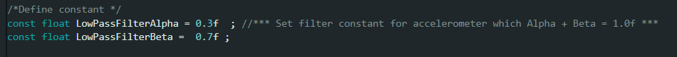
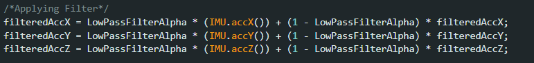
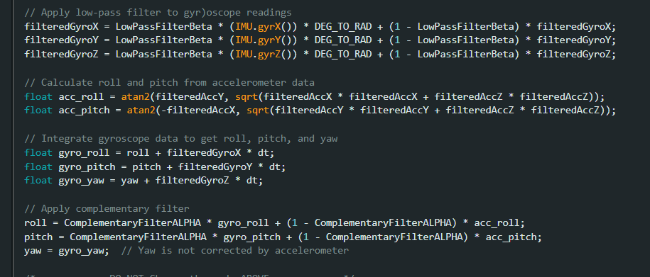
*The filter code as it appears in the original manual*

**Display mode switches** — these two lines are what you will switch on/off during the experiment:

```cpp
bool Filter = true;          // true = enable the filters
bool SerialPlotGrapgh = false; // true = also print data for the Serial Plotter
```

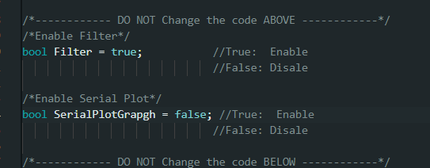
*Display mode settings (screenshot from the manual)*

### 5.6 Step-by-Step Instructions

**Step 1.** Open `Task_2.ino` (in the Task 2 folder) in the Arduino IDE.

**Step 2.** **Disable** both the Serial Plot and the filters (set `Filter = false`).

**Step 3.** Upload the sketch to the board.

**Step 4.** Open the **Chrome** browser and visit **https://imu.isdn2602.site**. Click **"Open Port"** and choose the port connected to the development board. You should see the sensor values and a 3D object labelled "ISDN 2602":

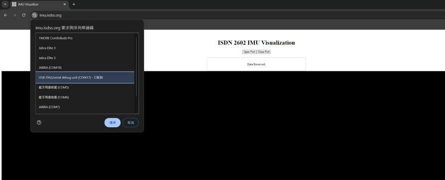
*The web app showing the live IMU values*

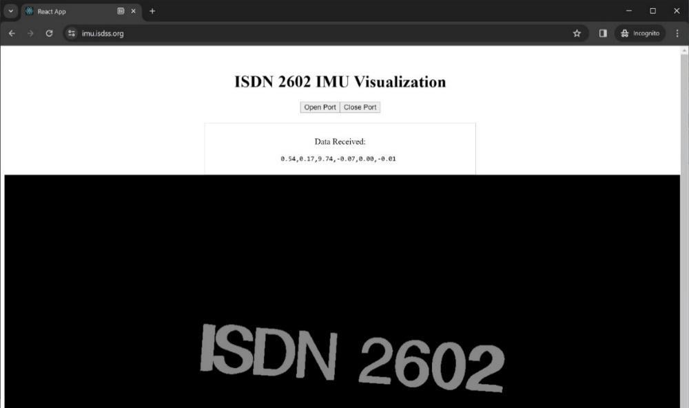
*The mapped object moves as you move the car*

**Step 5.** Pick up the car, move it and rotate it. Watch how the values change — and how the 3D object copies your movement. You'll notice the movement is **jumpy** (that's the noise!).

**Step 6.** Change the code to activate **only the Low-Pass Filter**. Upload again and observe — the movement should be smoother but may lag a little.

**Step 7.** Activate **both** the Low-Pass Filter and the Complementary Filter. Observe the result — smooth **and** stable.

**Step 8.** Enable the Serial Plot (`SerialPlotGrapgh = true`) and open the Arduino **Serial Plotter** (`Tools → Serial Plotter`) to see the data drawn as live curves. Repeat Steps 6 and 7 and compare the curves.

### 🏁 Check Point

Commit your code to the GitHub Classroom repository, and **show your result to the TA / instructor**.

---

## 6. Appendix — Extra Explanations from the Manual

### 6.1 What do `pulseIn`, `digitalWrite` and `pinMode` actually do?

| Function | What it does |
| -------- | ------------ |
| `pinMode(pin, OUTPUT/INPUT)` | Tells the ESP32 whether a pin will send or receive electricity |
| `digitalWrite(pin, HIGH/LOW)` | Sets a pin to 3.3 V (HIGH) or 0 V (LOW) |
| `pulseIn(pin, HIGH)` | Times how long the pin stays HIGH — this is our echo time |
| `delay(ms)` / `delayMicroseconds(µs)` | Pauses the program for some milliseconds / microseconds |
| `Serial.print()` | Sends text to the computer via the Serial Monitor |

### 6.2 The appendix code screenshots from the original manual

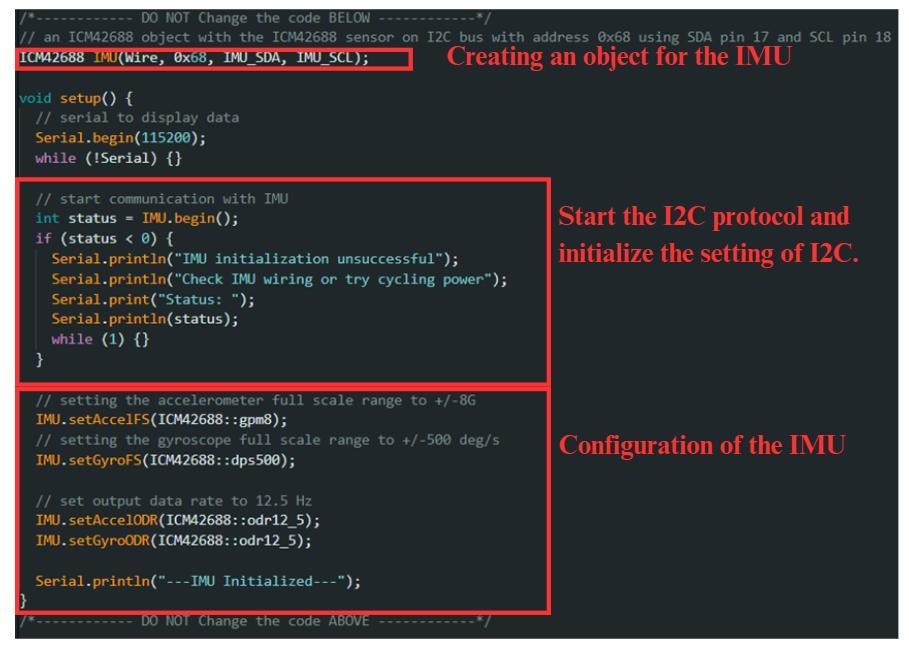
*Appendix: initialization of the I2C channel and configuration of the IMU*

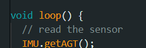
*Appendix: the function that reads all data from the IMU*

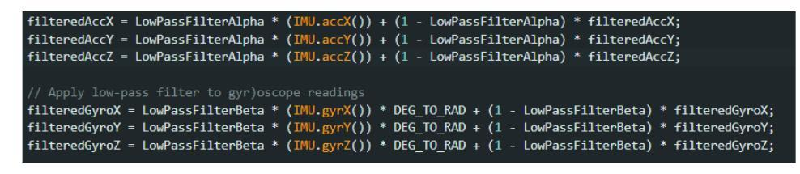
*Appendix: the Low-Pass Filter in C++ (Alpha and Beta = 1 − Alpha)*

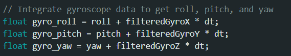
*Appendix: integrating the gyroscope data (multiply by dt = 0.01 s)*

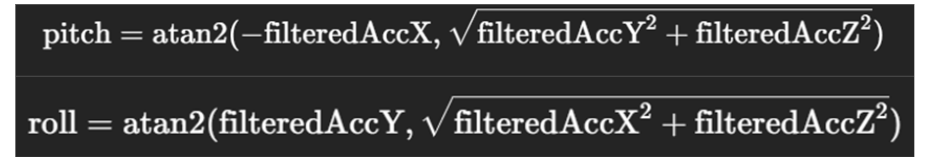
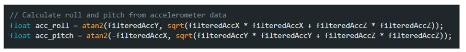
*Appendix: the pitch/roll equations and their C++ implementation*

---

*— End of Lab 2 —*
