# Lab 5 — Routing: Finding the Shortest Path *(Student Guide)*

> Adapted from HKUST ISDN 2602 (Fall 2025) Laboratory 5 for secondary school students.
>
> **Original course info** — GitHub Classroom: https://classroom.github.com/a/MzDeb8b5 · Deadline: Nov 5 (Wed), 2025, 23:59 · Submit code via GitHub + answer sheet as a Word file.

---

## 1. Overview and Learning Outcomes

Every navigation application solves the same underlying problem — computing the cheapest route on a weighted graph. This laboratory covers both the theory and its implementation:

- Explain **graphs** and **weighted graphs** — the mathematics behind every map and navigation application
- Apply **Dijkstra's algorithm** — the classic method for finding the shortest path
- Simulate the algorithm in **MATLAB**
- Program a robotic car to **follow a line** and **make decisions at a crossroad** using **FreeRTOS** multitasking

**Key words:** graph · node · edge · weight · shortest path · Dijkstra's algorithm · matrix · multitasking · RTOS · task · IR sensor · truth table

---

## 2. Background — Graphs and Dijkstra's Algorithm

### 2.1 Graphs

In mathematics, a **graph** is not a bar chart: it is a set of **nodes** (dots) connected by **edges** (lines). Graphs appear in many everyday systems:

- The **MTR map**: stations are nodes, train lines are edges
- A **road map**: intersections are nodes, roads are edges
- **Social networks**: people are nodes, friendships are edges

A **weighted graph** adds a number (a *weight*, or *cost*) to every edge — for example, the travel **time** between two stations, the **distance** between two intersections, or the **toll** on a road. Weights are usually positive numbers.

### 2.2 The Shortest-Path Problem

Given a weighted graph, a start node and an end node, the problem is to find the cheapest route — the same problem a map application solves for every journey.

### 2.3 Dijkstra's Algorithm

Dijkstra's algorithm (invented by computer scientist Edsger Dijkstra in 1956, and now used throughout network routing and pathfinding) finds the shortest path from a start node to every other node. The idea in three steps:

1. **Initialization:** start at the source node. Set its distance to **0**, and every other node's distance to **infinity (∞)** — indicating that no route to it is known yet.
2. **Exploration:** visit the unvisited node with the *smallest known distance*. Examine its neighbours: if going through this node gives a shorter route, **update** the neighbour's distance.
3. **Repeat:** keep selecting the nearest unvisited node and updating distances, until all nodes are visited (or until the target is reached).

### 2.4 Worked Example

A small graph (reproducing it on paper is recommended):

```
        3            4
   A -------- B ---------- C
   |          |            |
   |          | 8          | 2
   |          +-----+------+
  10|                |
   |                D
   +----------------+
```

Edges: A–B = 3, A–C = 10, B–C = 4, B–D = 8, C–D = 2. **Find the shortest path A → D.**

| Step | We visit | What we check | Distances after (A, B, C, D) |
| ---- | -------- | ------------- | ---------------------------- |
| 1 | — (initial) | — | (0, ∞, ∞, ∞) |
| 2 | **A** (dist 0) | A→B: 0+3=3 ✔ · A→C: 0+10=10 ✔ | (0, 3, 10, ∞) |
| 3 | **B** (smallest = 3) | B→C: 3+4=7 < 10 ✔ update · B→D: 3+8=11 ✔ | (0, 3, 7, 11) |
| 4 | **C** (smallest = 7) | C→D: 7+2=9 < 11 ✔ update | (0, 3, 7, 9) |
| 5 | **D** (smallest = 9) | target reached | (0, 3, 7, 9) |

Now **backtrack** from D: D was last updated from **C**, C from **B**, B from **A**. The shortest path is therefore **A → B → C → D** with total cost **9** — shorter than A–B–D (11) and A–C (10). This is the key property of Dijkstra's algorithm: it discovers that a route through more intermediate nodes can be cheaper than the direct alternatives.

### 2.5 What Is MATLAB?

**MATLAB** is a programming environment used widely in engineering. Its strength is computation with **matrices** (rectangular tables of numbers) — and a graph's weights can be stored directly in a matrix, as Part I demonstrates.

---

## 3. Part I — Simulating Dijkstra's Algorithm in MATLAB

### Task 1 — Find the Shortest Path by Dijkstra's Algorithm

This task uses the following weighted graph:

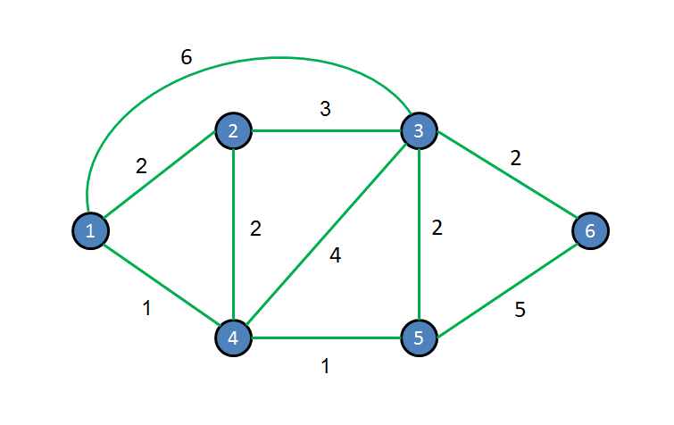
*Example of a weighted graph (from the lab manual)*

**Step 1.** Open the file `Task1.m` in the MATLAB editor and run it.

**Step 2.** Understand how the graph is stored. There is an **n × n array** `Graph(i,j)` of weights/costs, where `n` is the number of nodes:

- `Graph(i,j)` = the cost between nodes `i` and `j`
- `Graph(i,j) = 0` when `i = j` (the cost from a node to itself is zero)
- `Graph(i,j) = inf` when nodes `i` and `j` are **not** connected

For a 4-node graph:

```matlab
Graph = [ 0    3   10  inf ;
          3    0    4    8 ;
         10    4    0    2 ;
         inf   8    2    0 ];
```

**Step 3.** The function `fun_dijkstra()` finds the shortest path. It takes three inputs — the `Graph` array, the **source** node and the **destination** node — and returns the path and its cost:

```matlab
[path, cost] = fun_dijkstra(Graph, source, dest)
```

The provided code finds the shortest path from **node 1 to node 3** as `(1 > 4 > 5 > 3)` with **cost = 4**. Read the result and confirm that it is understood.

### Check Point 1

Modify the code to find the shortest path from **node 1 to node 6** and note the cost. Write the answer in the answer sheet, and **show the result to the TA / instructor**.

### Task 2 — Create the Graph (Hong Kong Traffic Map)

This task uses a map of Hong Kong traffic conditions:

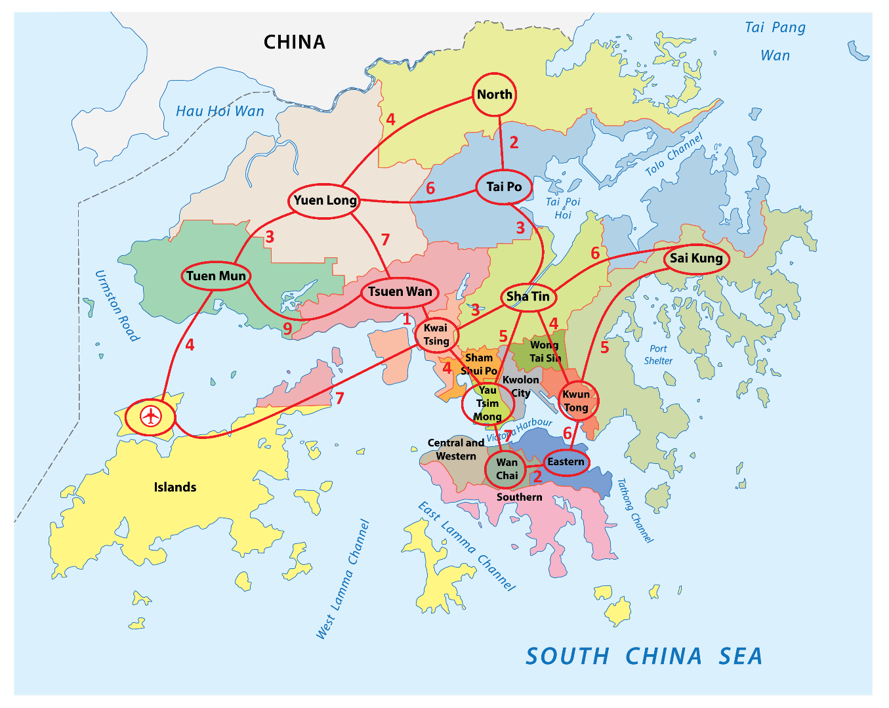
*Traffic situation of Hong Kong — the red integers are the traffic costs between connected districts*

The districts are numbered as nodes:

| Node | District      | Node | District      |
| ---- | ------------- | ---- | ------------- |
| 1    | North         | 8    | Kwai Tsing    |
| 2    | Tai Po        | 9    | Yau Tsim Mong |
| 3    | Yuen Long     | 10   | Kwun Tong     |
| 4    | Tuen Mun      | 11   | Wan Chai      |
| 5    | Tsuen Wan     | 12   | Eastern       |
| 6    | Sha Tin       | 13   | Airport       |
| 7    | Sai Kung      |      |               |

**Step 1.** Read the map: every **red integer** between two connected districts is the traffic cost for that edge.

**Step 2.** Open `Task2.m` in the MATLAB editor.

**Step 3.** Create the 13 × 13 weighted matrix. Notes:

- Fill the diagonal with 0
- Put the red number in `Graph(i,j)` **and** `Graph(j,i)` (the roads are bidirectional)
- Put `inf` everywhere the map shows no direct connection

### Check Point 2

1. Show the array created to represent the weighted graph.
2. Find the shortest path from **Yuen Long (node 3) to Eastern (node 12)** and its cost.

Fill in the answers, commit the revised code to GitHub, and **show the result to the TA / instructor**.

---

## 4. Part II — Running Dijkstra on a Real Car

### Task 3 (Pre) — The Robotic Car

This is the same car used for the final project:

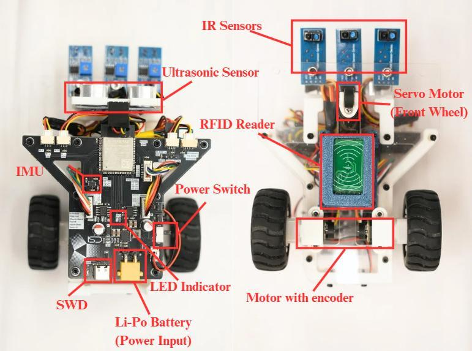
*Composition of the robotic car*

**Hardware:** ESP32-S3 microcontroller, IR sensors underneath (for line tracking), ultrasonic sensor, IMU, encoder motors, RFID reader, servo front wheel, and a 7.4 V Li-Po battery. This lab uses only the **motor drivers** and the **IR sensors**.

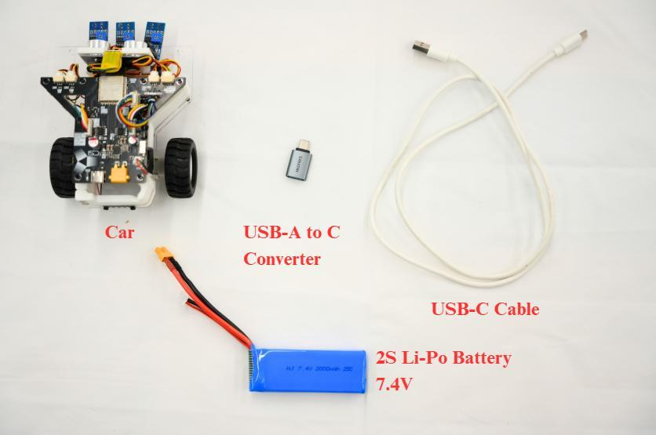
*Materials for Tasks 3 & 4*

**Code files** to open in the Arduino IDE:

- `IRSensors.cpp` / `IRSensors.hpp`
- `Lab06.ino` *(main sketch — the manual keeps this name)*
- `MotorControl.cpp` / `MotorControl.hpp`
- `Movement.cpp` / `Movement.hpp`
- `Pinout.hpp`


*The code folder contents*

> **Important:** do not modify the code unless the manual instructs it — in particular **`Pinout.hpp`**. The pinout file maps every wire to its pin number; any change prevents the car from working.

The Arduino IDE board settings are the same as Lab 2 (board = **ESP32S3 Dev Module**; use the same Tools settings table from Lab 2):

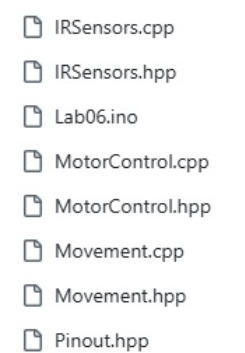
*Upload configuration of the board*

### Installing the Battery (Step by Step)

**Step 1.** Open the battery cover on the **backside** of the car:

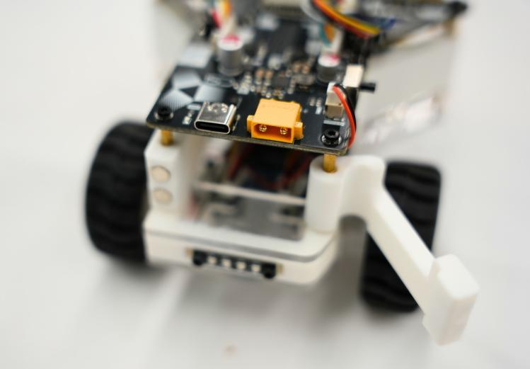
*Opening the battery cover on the backside of the car*

**Step 2.** Place the battery inside:

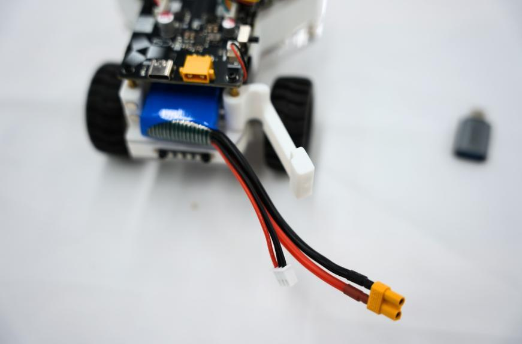
*Placement of the battery*

**Step 3.** Close the battery cover:

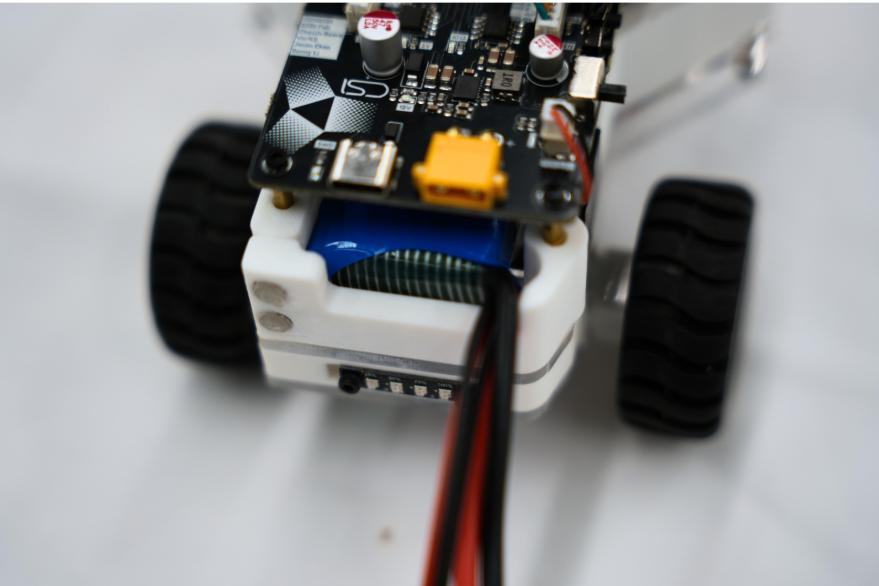
*Closing the battery cover*

**Step 4.** Plug the battery's power plug (**XT30 connector** — it fits only one way; never force it) into the socket on the car. The **battery voltage indicator** lights up:

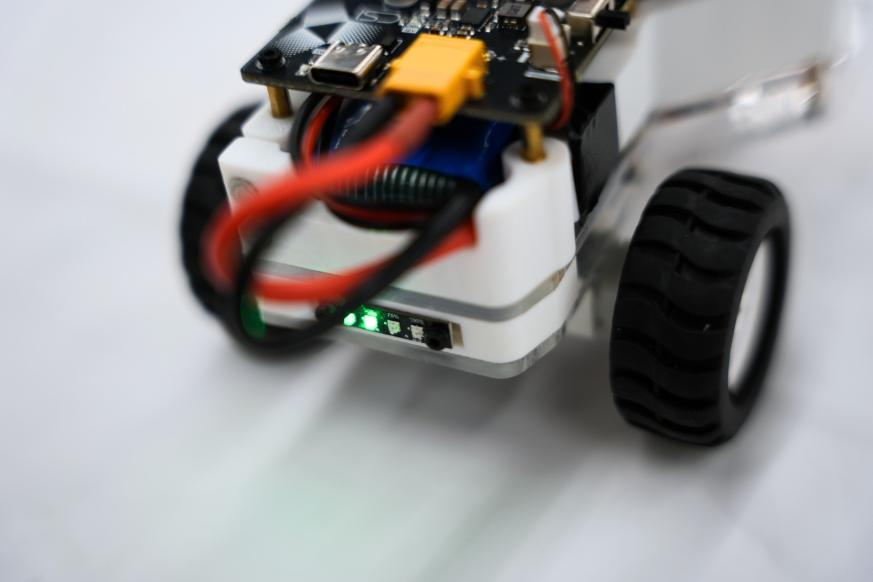
*Plug the XT30 power plug — the voltage level indicator lights up*

### First Upload — the Blinking LED Test

**Step 1.** Connect the car with USB and upload the provided test code (press **Upload** and wait).

**Step 2.** An LED on the chassis should start **blinking**:

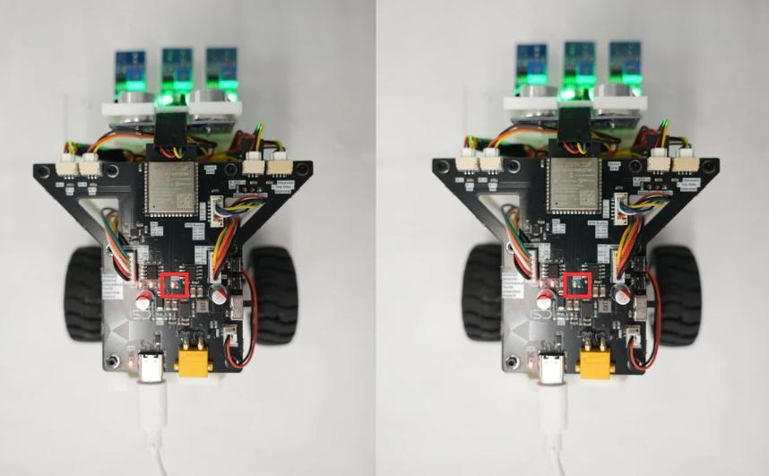
*The blinking LED of the car*

### Check Point

1. Check that all the wires are properly connected.
2. Plug the Li-Po battery into the power plug.
3. Turn on the car.
4. Upload the testing code.
5. Check whether the LED on the chassis is blinking.

**Show the result to the TA / instructor.**

---

### Task 2 — Multitasking for ESP32 (FreeRTOS)

*(The original manual numbers this section "Task 2" although it follows Task 3 (Pre); the numbering is retained for reference.)*

#### Background: The Need for Multitasking

So far the programs have used a **"superloop"**: code runs top-to-bottom, forever, one thing at a time. For simple programs this is sufficient. Consider, however, a car that must reconnect to Wi-Fi, follow a line, and read sensors at the same time: if the Wi-Fi code blocks while waiting, **every other activity stops as well**.

The solution is a **multitasking system**, in which the chip switches between jobs fast enough to appear simultaneous. This lab uses **FreeRTOS** — a free, open-source **Real-Time Operating System (RTOS)** already built into the ESP32. It is designed for the ESP32's **dual-core** processor (two cores that can execute two tasks concurrently), with task priorities, precise timing, and minimal memory use.

#### The Code

**Step 1 — Include the FreeRTOS libraries** (already in the skeleton):

```cpp
#include "freertos/FreeRTOS.h"
#include "freertos/task.h"
#include "freertos/semphr.h"   // semaphores (task signalling)
#include "freertos/queue.h"    // queues (task messaging)
```

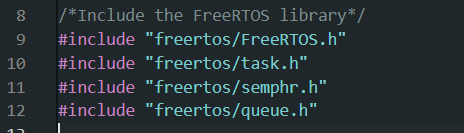
*The skeleton code with FreeRTOS enabled*

**Step 2 — Write a task function.** In FreeRTOS, instead of placing everything in `loop()`, separate **tasks** are written. To create one, a `StackType`, `TaskTCB` and `TaskHandle` are initialized, then the task function takes this form (LED blink example):

```cpp
void Blink(void *pvPara) {
  pinMode(LED1, OUTPUT);          // setup part — runs once
  while (true) {                  // running part — loops forever
    digitalWrite(LED1, HIGH);
    vTaskDelay(100);              // wait 100 ms
    digitalWrite(LED1, LOW);
    vTaskDelay(200);
  }
}
```

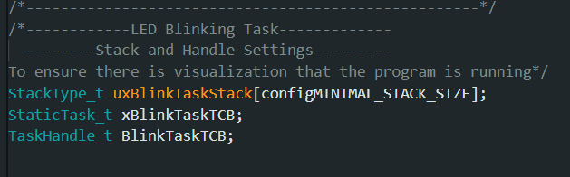
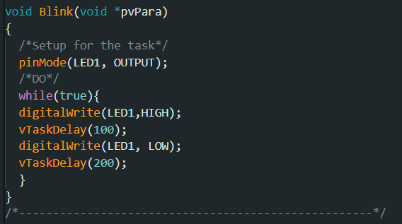
*Creating a user task (screenshots from the manual)*

Every task function follows the template `void TaskName(void *pvPara)` and has two parts:

1. **The Setup part** — runs only once (e.g. `pinMode`)
2. **The Running part** — a `while(true)` loop that never ends

> **Important — two rules:**
> 1. `void *pvPara` **must** be present, even when unused.
> 2. Inside the `while` loop, call **`vTaskDelay()`**, not Arduino's `delay()`. (`delay()` internally calls `vTaskDelay()` — use `vTaskDelay()` directly.) **Without a `vTaskDelay()`, the task will never actually run on the MCU.** The delay is the point at which FreeRTOS passes the CPU to other tasks.

**Step 3 — Create the task and "pin" it to a CPU core**, inside `void setup()`:

```cpp
xTaskCreatePinnedToCore(
  Blink,              // 1. the task function to run
  "Blinking",         // 2. a human-friendly name (shows in debugging)
  2000,               // 3. stack size (bytes of memory given to the task)
  NULL,               // 4. parameters to pass (NULL = none)
  1,                  // 5. priority (bigger = more important)
  &BlinkTaskHandle,   // 6. handle to control the task later
  1                   // 7. which CPU core to pin it to (0 or 1)
);
```

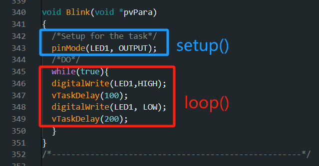
*Creating the task and pinning it to a core (screenshot from the manual)*

**Step 4 — Also create the Movement task** (a larger stack, because the movement code needs more memory):

```cpp
xTaskCreatePinnedToCore(
  MovementTask,
  "Movement",
  12000,               // larger stack than the Blink task
  NULL,
  1,
  &MovementTaskHandle,
  1
);
```

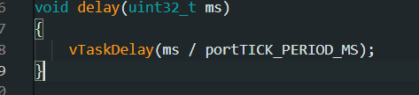
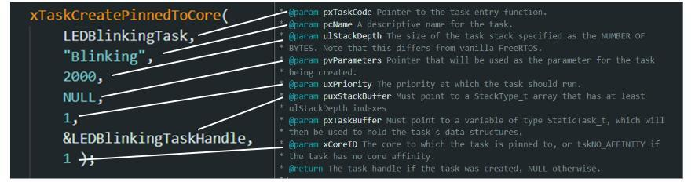
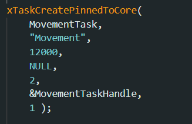
*Including the Movement Task (screenshots from the manual)*

### Check Point — Test the Movement

Upload and test. The default behaviour of the car:

- All IR sensors on a **white tile** → move **forward**
- All IR sensors off the ground (white background) → **stop**
- Otherwise → **turn right** (left wheel clockwise, right wheel anti-clockwise)

**Show the result to the TA / instructor.**

---

### Task 4 — Basic Line Tracking

This is the track the car must follow:

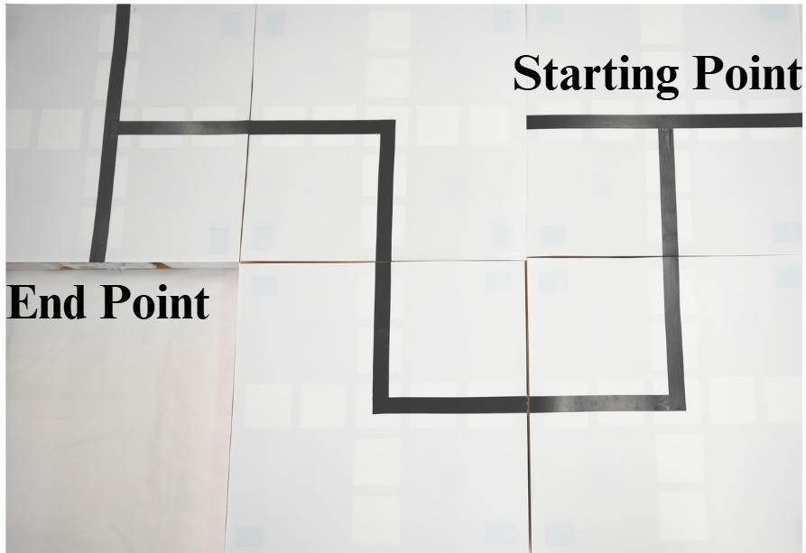
*The line tracking map*

#### Background: IR Line Sensors

Under the car are **three IR (infrared) sensors** — left, middle, right. Each shines infrared light at the floor and measures how much is reflected:

- A **black** surface **absorbs** infrared → little reflection → output = **1 (HIGH)**
- A **white** surface **reflects** infrared → much reflection → output = **0 (LOW)**

The sensor positions and names (defined in `IRSensors.hpp`):

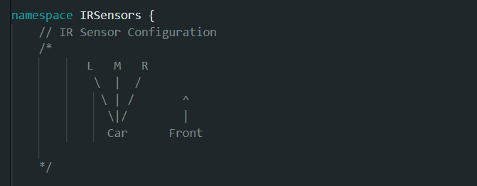
*The naming and position of the IR sensors (IR_L, IR_M, IR_R)*

Each combination of the three sensors maps to a named state, defined by this `enum` in `IRSensors.hpp`:

```cpp
enum RobotState : uint8_t {
  Middle_ON_Track,      // only the middle sensor sees the line
  Left_Middle_ON_Track, // left + middle see the line
  ALL_ON_Track,         // all three see the line
  Right_ON_Track,       // only the right sensor sees the line
  Left_Right_ON_Track,  // left + right (crossroad)
  Middle_Right_ON_Track,// middle + right
  Left_ON_Track,        // only the left sensor sees the line
  All_OFF_Track         // no sensor sees the line
};
```

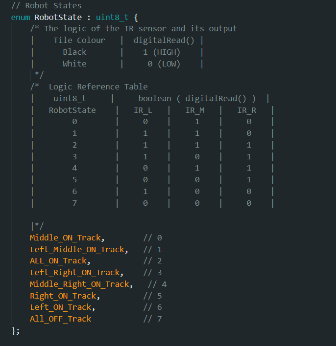
*The defined values for each IR sensor condition (screenshot from the manual)*

#### The Tracking Logic

The basic idea:

- If the **middle** sensor is on the dark line → continue **forward**
- If the **left** sensor is on the dark line → the car has drifted right → **turn left**
- If the **right** sensor is on the dark line → the car has drifted left → **turn right**

Plan the behaviour with a **truth table** — a table that specifies an action for every combination of inputs. The first row is completed as an example; complete the remaining rows, considering what each combination of sensor states indicates (one row is provided per sensor state):

| Left (IR_L) | Middle (IR_M) | Right (IR_R) | State | Action |
| ----------- | ------------- | ------------ | ----- | ------ |
| 0 | 1 | 0 | Middle on track | Move forward (example) |
| 0 | 0 | 0 | All off track | *your answer* |
| 0 | 0 | 1 | Right on track | *your answer* |
| 0 | 1 | 1 | Middle + right | *your answer* |
| 1 | 0 | 0 | Left on track | *your answer* |
| 1 | 0 | 1 | Left + right | *your answer* |
| 1 | 1 | 0 | Left + middle | *your answer* |
| 1 | 1 | 1 | All on track | *your answer* |

#### The Code to Complete

In `void MovementTask(void* pvPara)` in the `.ino` file, the sensor state is read into `IRSensors::IRData.state`, then a `switch` statement decides the action. **Complete the missing cases:**

```cpp
void MovementTask(void* pPara) {
  while (true) {
    IRSensors::IRData.state = IRSensors::Readsensorstate(IRSensors::IRData);
    switch (IRSensors::IRData.state) {
      case IRSensors::Middle_ON_Track:
        MotorControl::LeftWheel.Speed = 1000;    // set left wheel speed
        MotorControl::Rightwheel.Speed = 1000;   // set right wheel speed
        break;
      case IRSensors::Left_Middle_ON_Track:
        // implement logic
        break;
      case IRSensors::ALL_ON_Track:
        // implement logic
        break;
      case IRSensors::Left_Right_ON_Track:
        Movement::Stop();                        // crossroad → stop (for now)
        vTaskDelay(100);
        break;
      case IRSensors::Middle_Right_ON_Track:
        // implement logic
        break;
      case IRSensors::Right_ON_Track:
        // implement logic
        break;
      case IRSensors::Left_ON_Track:
        // implement logic
        break;
      case IRSensors::All_OFF_Track:
        Movement::Stop();                        // line lost → stop
        vTaskDelay(100);
        break;
    }
    vTaskDelay(100);
  }
}
```

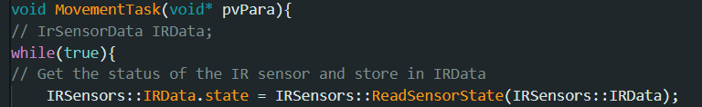
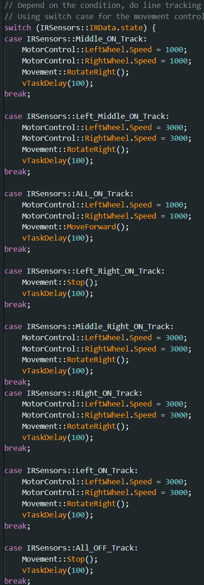
*Reading the sensor state and the switch-case (screenshots from the manual)*

To move the car, use the API from `Movement.hpp` / `Movement.cpp` (all functions live in the `Movement` namespace):

```cpp
void RotateLeft();    // spin left
void RotateRight();   // spin right
void MoveForward();   // straight ahead
void MoveBackward();  // reverse
void Stop();          // stop
```

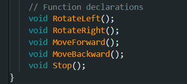
*The movement API in `Movement.hpp`*

To drive the car, set the speed of both wheels, then call the actuation function:

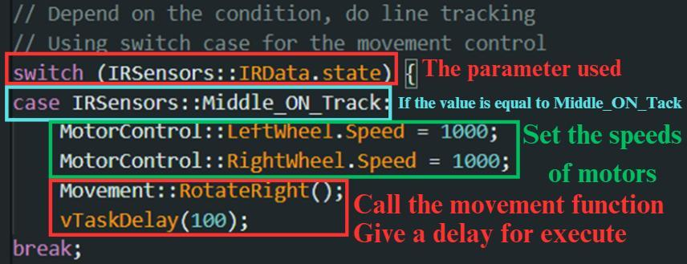
*Setting the speeds of both wheels, then actuating*

> For the full API manual visit: **https://project.isdn2602.site**

#### Procedure

1. Place the car at the **starting line** of the track.
2. Power on the car.
3. After 1–2 seconds, the car starts to move.
4. It should follow the track and **stop at the end line**.

**Complete the truth table, then adjust the movement functions and wheel speeds carefully** until the car follows the whole track.

### Check Point

Change the movement functions inside the switch-case so the car tracks the line, and **show the result to the TA / instructor**.

---

### Task 5 — Line Tracking with Decision Making

This track contains a **crossroad** at which the car must make a decision:

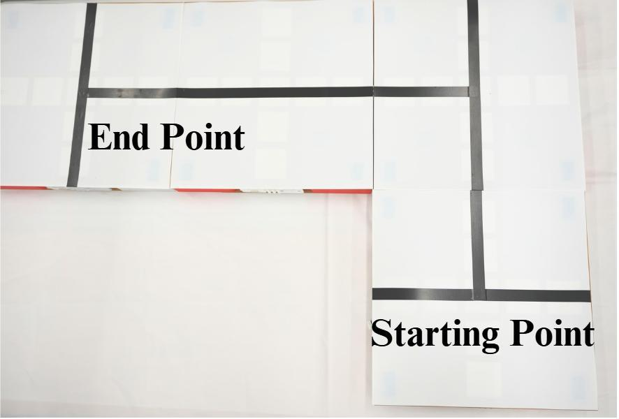
*The Task 5 map — note the crossroad*

In this task the car decides at the crossroad, building on the line-tracking logic from Task 4.

**Procedure:**

1. Start the car at the **left side** of the track.
2. After 1–2 seconds, the car starts to move.
3. When the car arrives at the crossroad, **turn right** and follow the left track.
4. Stop the car at the end line.

> **Hint:** at a crossroad, all sensors see the line at once — the `ALL_ON_Track` or `Left_Right_ON_Track` state. Instead of stopping, count a short delay and then rotate.

### Check Point

Modify the logic and conditions of the helper function to complete this task, and **show the result to the TA / instructor**.

---

## 5. Appendix — How `fun_dijkstra()` Works (Line by Line)

This is the full MATLAB function used in Tasks 1 & 2, with explanations:

```matlab
function [path, cost] = fun_dijkstra(transition, from, to)
```

- **Inputs:** `transition` — the weight matrix; `from` — list of start nodes; `to` — list of destination nodes.
- **Outputs:** `path` — cell array storing the shortest paths; `cost` — matrix of shortest path costs.

**Memory allocation:**

```matlab
path = cell(numel(from), numel(to));
cost = zeros(numel(from), numel(to));
```

One slot in `path` and `cost` for every start–destination pair.

**Main variables:**

```matlab
count  = min(size(transition));   % number of nodes
parent = zeros(count, 1);         % parent(n) = which node we reached n from
loss   = inf(count, 1);           % loss(n) = best known distance so far
```

**Loop over every start node `m`:**

```matlab
for i = 1:numel(from)
    m = from(i);
    if issparse(transition)
        index = transpose(full(transition(m, :) > 0.0));
        index(m) = true;
    else
        index = transpose(not(isinf(transition(m, :))));
    end
```

`index` marks which nodes are **directly reachable** from `m` (weight is not `inf`).

```matlab
    loss(:) = inf;                          % reset all distances
    loss(index) = transpose(transition(m, index));   % known direct distances
    parent(:) = 0;                          % reset parents
    parent(index) = m;                      % they all came from m
    queue = find(index);                    % queue of nodes to examine
```

**The Dijkstra main loop** — exactly the algorithm from Section 2.4:

```matlab
    while not(isempty(queue))
        k = queue(1);                               % pick the first node in the queue
        distance = transpose(loss(k) + transition(k, :));  % new distances through k
        index = distance < loss;                    % where is going through k shorter?
        if issparse(transition)
            index = and(index, full(transpose(transition(k, :) > 0)));
        end
        if any(index)                    % found improvements
            loss(index) = distance(index);    % update best distances
            parent(index) = k;                % remember we came through k
            queue = cat(1, queue(2:end, :), find(index));  % add improved nodes to queue
        else
            queue = queue(2:end, :);      % no improvement → drop this node
        end
    end
```

**Backtracking** — rebuild the path by walking *backwards* from the destination, following `parent`:

```matlab
    for j = 1:numel(to)
        path{i, j} = zeros(size(parent));
        n = to(j);                          % start at the destination
        for k = numel(parent):(-1):1
            if or(eq(m, n), eq(n, 0))
                break                       % reached the start node (or no path)
            end
            path{i, j}(k) = n;              % record node
            n = parent(n);                  % hop to its parent
        end
        if eq(m, n)                         % successfully walked back to m
            path{i, j}(k) = n;
            path{i, j} = path{i, j}(k:end); % trim the leading zeros
        else
            path{i, j} = [];                % no valid path exists
        end
    end
    cost(i, :) = loss(to);                  % store the shortest path costs
end
end
```

---

*— End of Lab 5 —*
