# Lab 6 — Firebase & RFID: Connecting Your Car to the Cloud *(Student Guide)*

> Adapted from HKUST ISDN 2602 (Fall 2025) Laboratory 6 for secondary school students.
>
> **Original course info** — GitHub Classroom: https://classroom.github.com/a/NqRJUakP

---

## 1. Welcome — What You Will Learn

Today your robot car gets two superpowers: it can **talk to the cloud** and it can **identify objects** by touchless scanning. By the end you will:

- ☁️ Understand what a **cloud database** is and why it lets devices talk to each other
- 🔥 Set up your own free **Firebase** project (Google's app platform)
- 📡 Read and write data between the **ESP32** and Firebase in **real time**
- 🏷️ Use an **RFID reader** to identify RFID tags — the same technology as Hong Kong's **Octopus card**!

**Key words you will learn:** cloud · database · real-time · Firebase · JSON · API key · authentication · UID · RFID · tag · reader

---

## 2. Background — The Cloud, Firebase, and RFID

### 2.1 What Is "the Cloud"?

"The cloud" sounds mysterious, but it just means: **powerful computers in data centres that store data and run services for you, connected through the internet**. When you save a photo so it appears on all your devices, or when two people edit the same document at once — that's the cloud at work.

Why does a robot car need it? Imagine the final project: an **app or website** decides the car's mission (start point, end point, whether the exam has started...), and the **car** must receive that information instantly. If both the app and the car talk to **one shared database in the cloud**, changing a value on the app instantly appears on the car — no direct connection needed. It's like a shared Google Doc: you edit here, your classmate sees it there, instantly.

### 2.2 What Is Firebase?

**Firebase** is Google's platform for building apps. It provides a whole toolbox — real-time database, user login (authentication), hosting, and more. In this lab we use the **Realtime Database**:

- It is a **NoSQL** database that stores data as one big **JSON tree** (see §2.3)
- **Real-time sync:** the moment one client changes the data, every other connected client is updated — perfect for our car ↔ app link
- **Free** for small projects like this one

Why Firebase is popular for personal IoT projects: simplified setup (no server to build), real-time sync, built-in authentication, serverless (Google runs the servers for you), and it works across platforms.

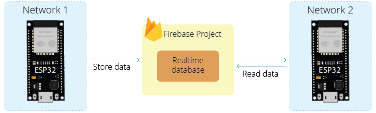
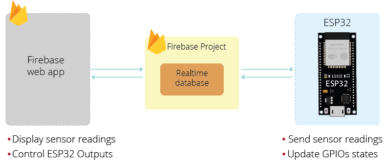
*How the ESP32 talks to Firebase's Realtime Database (source: https://randomnerdtutorials.com/esp32-firebase-realtime-database/)*

### 2.3 A 60-Second JSON Lesson

**JSON** (JavaScript Object Notation) is the standard "language" for data on the internet — a simple way to write labelled information, like an ID card:

```json
{
  "name": "Smart Car",
  "task_id": 7,
  "is_started": false
}
```

Curly braces hold a **object**; each line is a `"key": value` pair. Values can be text (in quotes), numbers, true/false, or even nested objects. Firebase stores your whole database as one JSON tree — you'll import one in Task 1.

### 2.4 API Keys, Users, and UIDs — Your Car's ID Papers

To keep random strangers out of your database, Firebase uses **authentication** — proving who you are. Today you will collect three "ID papers" (save them somewhere safe, you'll type them into your code!):

- **Web API Key** — like the address + master key of your Firebase project
- **Database URL** — the exact internet address of your database (`https://…firebasedatabase.app`)
- **User UID** — a random ID string Firebase gives each user account (each student's data is stored under their own UID, so nobody overwrites anyone else)

### 2.5 What Is RFID?

**Radio-Frequency Identification (RFID)** lets a small **reader** identify a **tag** using radio waves — no contact, no battery in the tag needed for *passive* tags (the reader's radio field briefly powers the tag, the tag answers with its stored ID). You use RFID all the time:

- 🚇 The **Octopus card** (and other contactless payment cards)
- 📚 Library book tags
- 🏫 School / office access cards

An RFID system has two parts: **tags** (store a unique ID) and a **reader** (sends radio signals; a nearby tag transmits its stored information back).

In the final project, **RFID tags are placed along the road**, and a **RFID reader at the bottom of the car** scans them as the car drives over. By reading a tag, the car knows exactly **where it is** — like how tapping your Octopus card tells the system which station you entered.

---

## 3. Prelab — Setting Up Your Firebase (Do This First!)

> 💡 **Tip:** do the prelab on your own laptop with Chrome. You will create a Firebase project and collect your three "ID papers". Nothing needs the car yet.

### Step 1 — Install the Arduino Libraries

Two libraries must be installed with the **correct versions**:

- **FirebaseClient** ≥ **2.2**
- **ArduinoJson** ≥ **7.4**

How: in the Arduino IDE open `Sketch → Include Library → Manage Libraries…`, search for each name, pick the version, click **Install**.

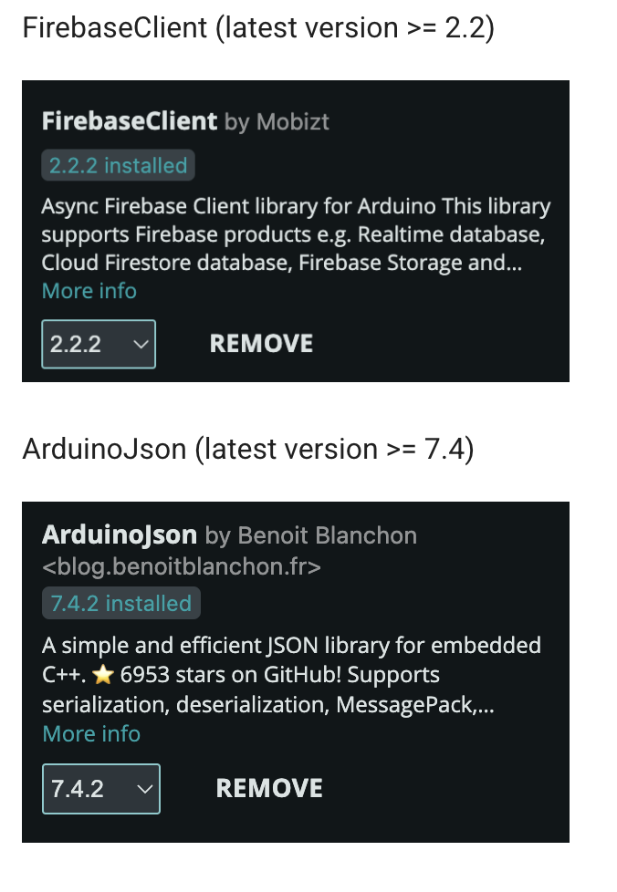
*Install FirebaseClient (≥ 2.2) and ArduinoJson (≥ 7.4)*

### Step 2 — Create a Firebase Account and Project

**1.** Visit **https://firebase.google.com** and sign in with your own Google account:

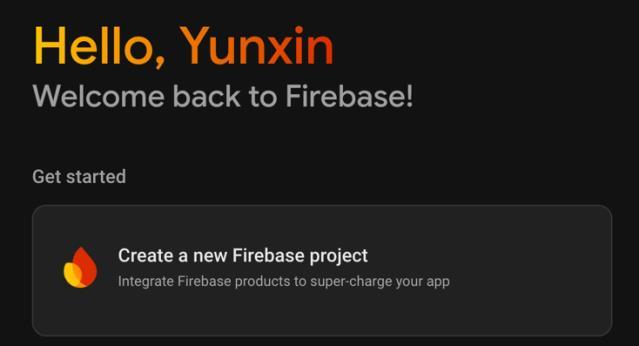
*Sign in at firebase.google.com*

**2.** Click **Get Started**, then press **Add Project** to create your project, and give it a name:

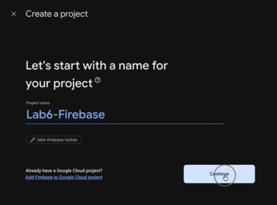
*Create your project and set a name*

**3.** You may choose **not** to enable Google Gemini and **not** to enable Google Analytics — just click **Continue**:

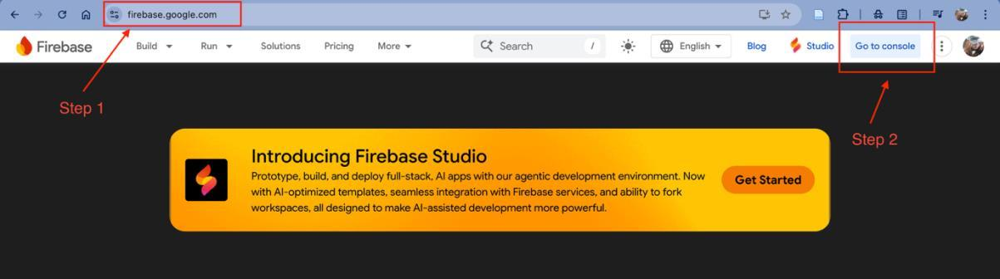
*Disabling Gemini / Analytics is fine for this lab*

**4.** Wait for the project to be ready — you'll land on the **project overview** page:

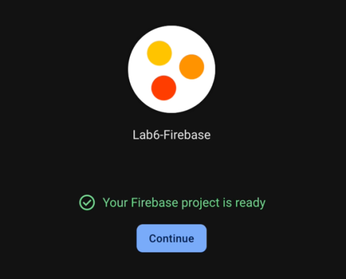
*The project overview page*

**5.** Under **Product categories → Build**, enable **Authentication** and **Realtime Database**. After selecting them one by one, they appear under **Project shortcuts**:

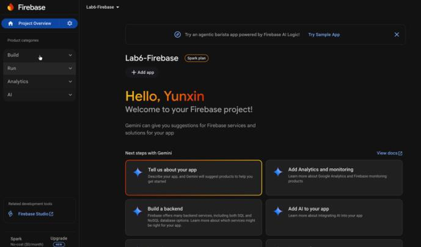
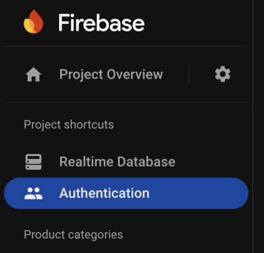
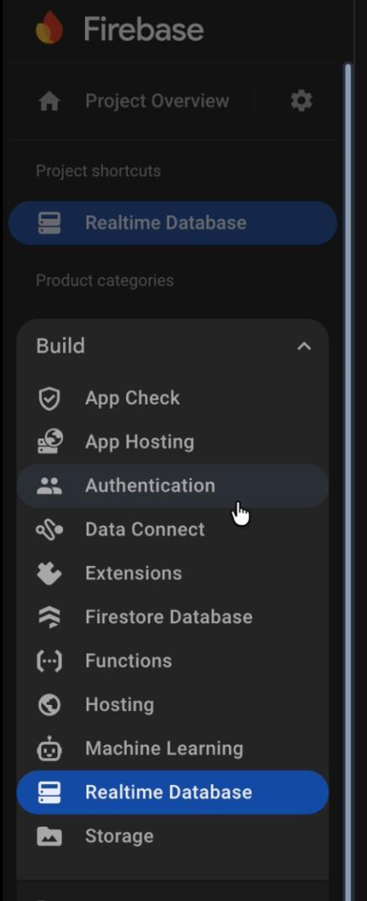
*Enable Authentication and Realtime Database under Build*

### Step 3 — Set Up the Realtime Database

**1.** Click the **Realtime Database** shortcut, then **Create Database**:

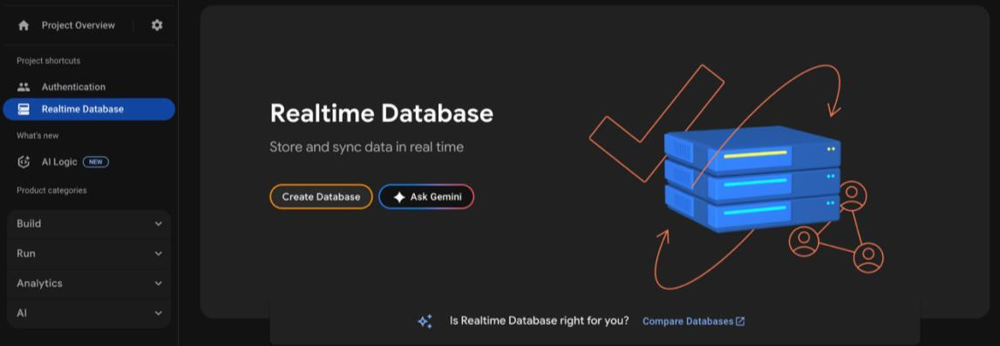
*Realtime Database → Create Database*

**2.** Set the configuration:

- **Location:** keep the default **United States (us-central1)**
- **Security rules:** choose **Start in test mode** (for now)

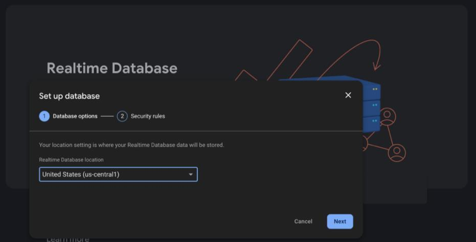
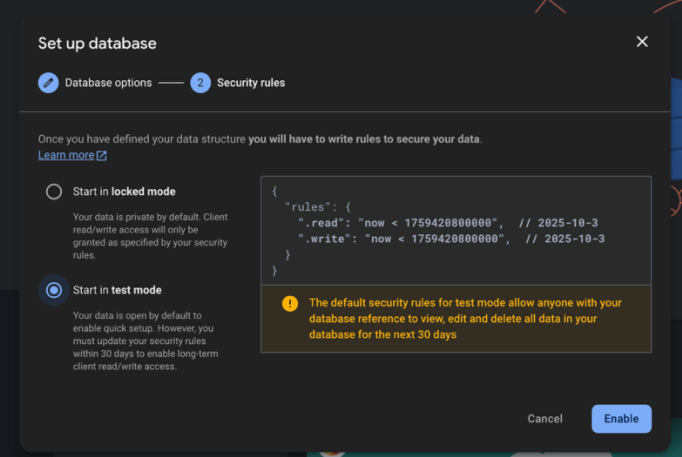
*Location: us-central1 · Security rules: test mode*

**3.** Your database is created! Click the **link icon** to copy your **database URL**:

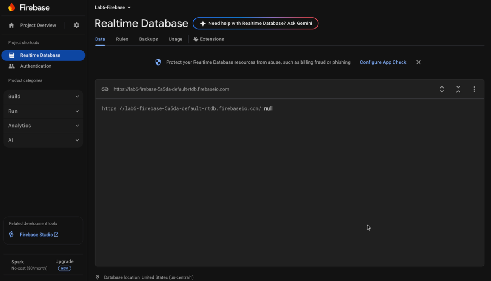
*Copy your database URL with the link icon*

> 💾 **Save it:** your **Database URL** (you'll paste it into the code at TODO 1).

### Step 4 — Get Your Project API Key

The ESP32 needs the **API Key** to prove to Firebase which project it belongs to.

**1.** Click the **gear icon** ⚙️ next to *Project Overview*, then **Project settings**:

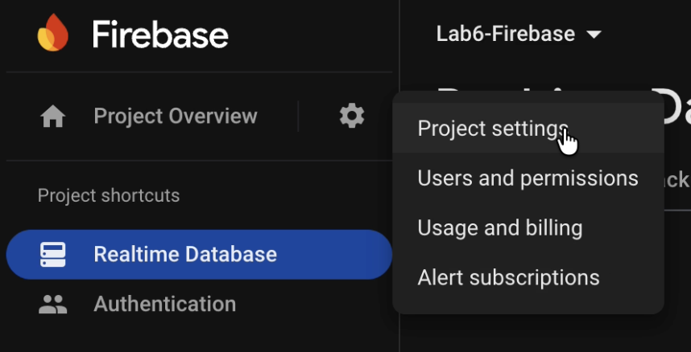
*Gear icon → Project settings*

**2.** Find and copy your **Web API Key**:

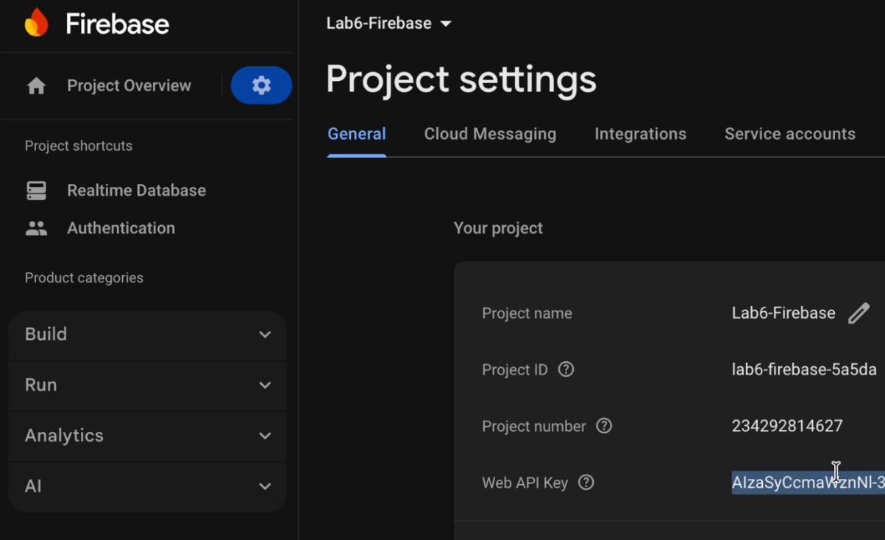
*Copy the Web API key*

**3.** *(If you don't see it there)* visit **https://console.cloud.google.com/apis/**, sign in again if needed, select your Firebase project, open the **Credentials** tab, and click **Show key**:

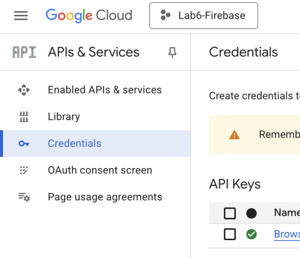
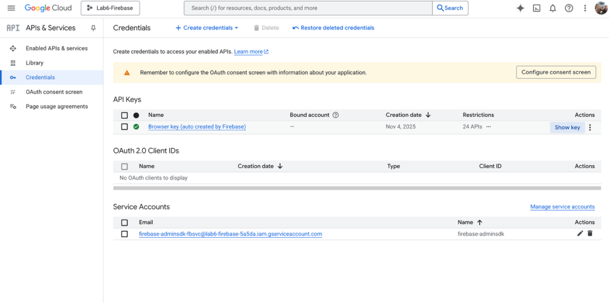
*Alternative route: Google Cloud console → Credentials → Show key*

> 💾 **Save it:** your **Web API Key** (also TODO 1).

### Step 5 — Set Up Authentication

**1.** Go to **Authentication** and click **Get started**. In the **Sign-in method** tab, choose **Email/Password**:

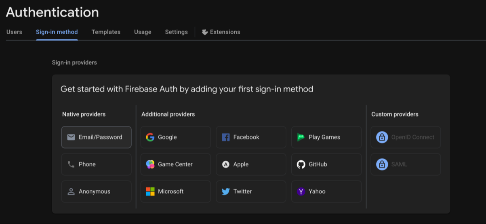
*Authentication → Get started → Email/Password*

**2.** Toggle **Email/Password ON** and press **Save**:

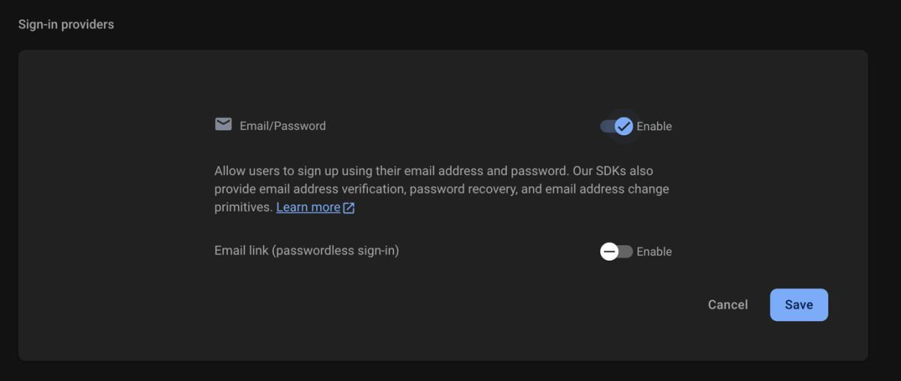
*Toggle on Email/Password and save*

**3.** In the **Users** tab, click **Add user** and enter an email + password. A simple password is fine — but **remember it**: you will type it into your Arduino code! After adding, your **User UID** is shown:

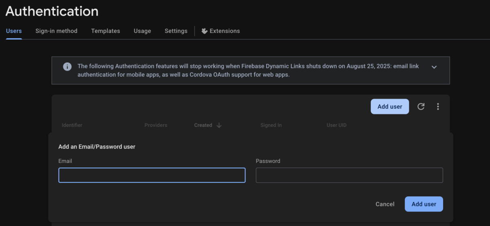
*Users → Add user (email + password)*

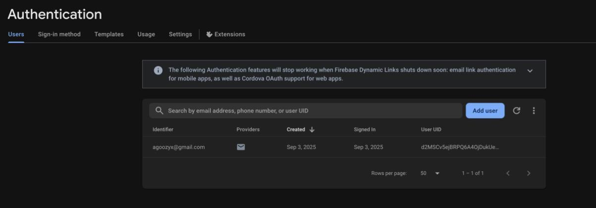
*After adding the user, note the User UID*

**4.** Also toggle on the **Anonymous** sign-in method — it makes it convenient for the smart car to access the data:

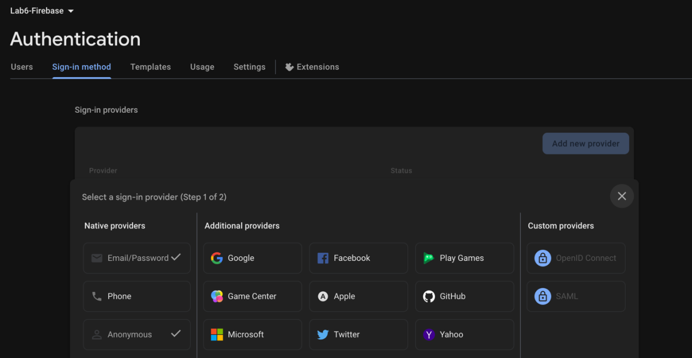
*Enable the Anonymous sign-in method too*

### ✅ Pre-Lab Complete! Your Checklist

Up to this point you should have these three things ready (paste them into a note file):

- ☁️ **Firebase Project Web API Key**
- 🔗 **Realtime Database URL**
- 🆔 **User ID (UID)**

---

## 4. Lab Tasks

### Task 1 — Reading Data from Firebase Using the ESP32

In the final project, your smart car receives information from Firebase — the start and end points, the task ID, the exam status (has the demo started or not?) — and makes real-time decisions based on it. In this task you practise reading.

**Step 1.** Open the file **`sample.json`** and replace `<YOUR_UID>` with your actual UID:

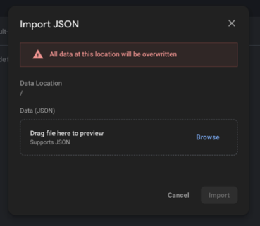
*Replace `<YOUR_UID>` with your real UID in sample.json*

This JSON format is similar to the final project's format, where each student's individual data is stored **under their own UID** to avoid conflicts and overwriting.

**Step 2.** Go to the **Firebase Realtime Database console**, click the **⋮ (three dots)** at the top right corner, and select **Import JSON** to upload `sample.json`:

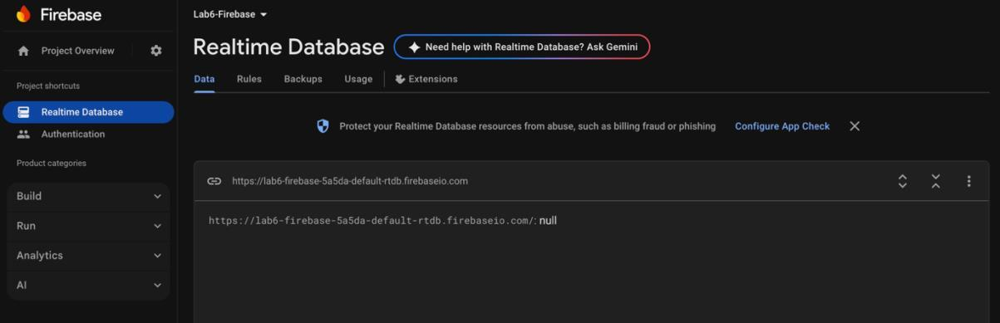
*Three dots → Import JSON*

**Step 3.** Add your credentials to the code at **`// TODO 1`**:

```cpp
#define API_KEY ""       // ← paste your Web API Key here
#define DATABASE_URL ""  // ← paste your Database URL here
```

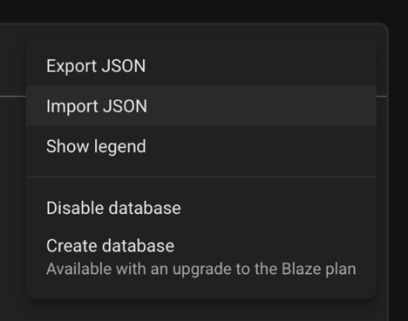
*Fill in API_KEY and DATABASE_URL at TODO 1*

**Step 4.** Add your UID at **`// TODO 2`**:

```cpp
String UID = "";         // ← paste your User UID here
```

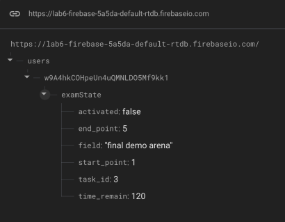
*Fill in the UID at TODO 2*

**Step 5.** Enable the **"Firebase Read Task"** in `setup()`, exactly as shown:

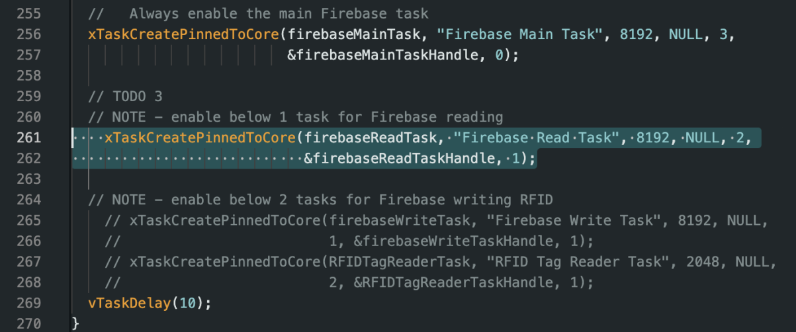
*Enable the Firebase Read Task*

```cpp
xTaskCreatePinnedToCore(firebaseMainTask, "Firebase Main Task", 8192, NULL, 3, &firebaseMainTaskHandle, 0);

// TODO 3: enable the read task
xTaskCreatePinnedToCore(firebaseReadTask, "Firebase.Read.Task", 8192, NULL, 2, &firebaseReadTaskHandle, 1);

//xTaskCreatePinnedToCore(firebaseWriteTask, "Firebase Write Task", 8192, NULL, 1, &firebaseWriteTaskHandle, 1);
//xTaskCreatePinnedToCore(RFIDTagReaderTask, "RFID.Tag-Reader.Task", 2048, NULL, 2, &RFIDTagReaderTaskHandle, 1);
vTaskDelay(10);
```

*(Notice this uses the FreeRTOS `xTaskCreatePinnedToCore` you learned in Lab 5 — one task talks to Firebase while others run the car! The two commented-out lines are for Task 2.)*

**Step 6.** **Flash the code** and watch the Serial Monitor: the exam-state values from your database should print out. Try **manually editing a value in the Firebase web console** (e.g. set `time_remain` to 100) — and watch the change appear on your car within a second or two. That's **real-time sync** in action!

#### ✅ Check Point

**Show the serial print result of your received data to the TA / instructor.**

---

### Task 2 — Reading RFID and Writing Data to Firebase

Now the flow reverses: the car **reads an RFID tag** and **writes** the result **up** to Firebase.

*(Recall §2.5: an RFID reader sends radio signals; a nearby tag replies with its stored ID. In the final project, tags along the road let the car know its current location.)*

**Step 1.** In the code at **TODO 3**, comment out the read task and enable the **"Firebase Write Task"** and the **"RFID Reader Task"** instead:

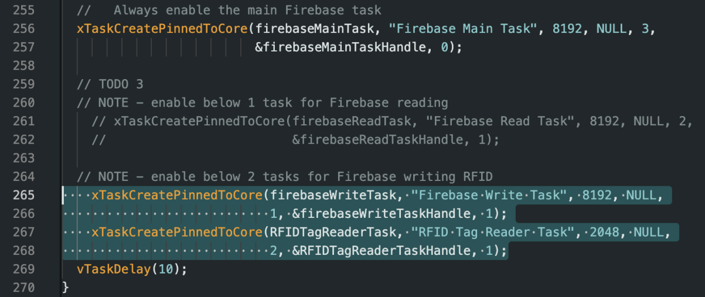
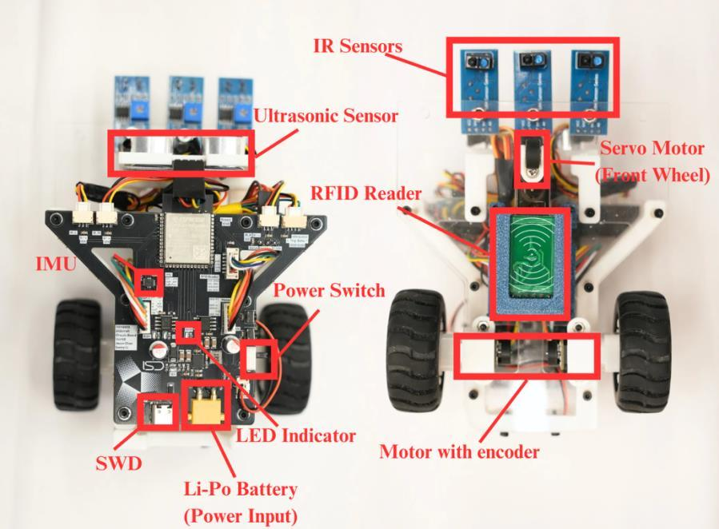
*Enable the Firebase Write Task and RFID Reader Task at TODO 3 (screenshots from the manual)*

```cpp
xTaskCreatePinnedToCore(firebaseMainTask, "Firebase Main Task", 8192, NULL, 3, &firebaseMainTaskHandle, 0);

//xTaskCreatePinnedToCore(firebaseReadTask, "Firebase.Read.Task", 8192, NULL, 2, &firebaseReadTaskHandle, 1);

xTaskCreatePinnedToCore(firebaseWriteTask, "Firebase Write Task", 8192, NULL, 1, &firebaseWriteTaskHandle, 1);
xTaskCreatePinnedToCore(RFIDTagReaderTask, "RFID.Tag-Reader.Task", 2048, NULL, 2, &RFIDTagReaderTaskHandle, 1);
vTaskDelay(10);
```

**Step 2.** Place an **RFID tag** under the RFID reader at the **bottom of the car** (like tapping an Octopus card on the reader, upside-down!). Watch two things:

1. The **Serial Monitor** prints the tag's value
2. The tag value appears in the **Firebase console** — the car uploaded it to the cloud by itself!

Expected serial output looks like:

```
RFID Initialized
Connecting to WiFi...
---Initializing---
Connected to WiFi network with IP Address: 192.168.110.159
RFID Tag: c3a75214
RFID_tag: "c3a75214"
```

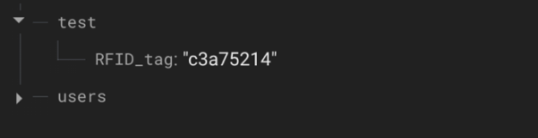
*Scanning an RFID tag under the car's reader*

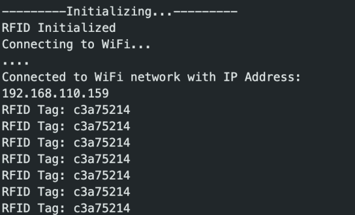
*The tag value appearing in the Firebase console*

#### ✅ Check Point

**Show your RFID scanning serial output and the Firebase console result to the TA / instructor.**

---

*— End of Lab 6 —*
