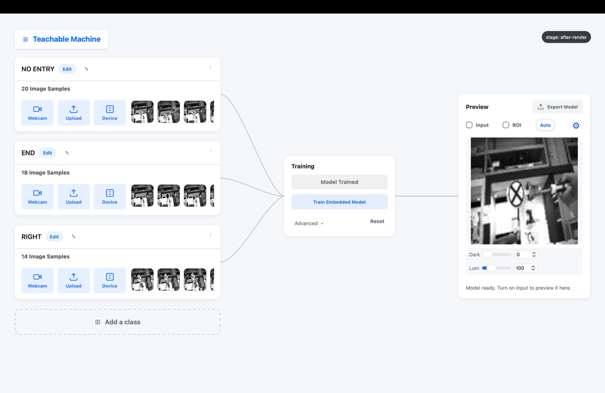
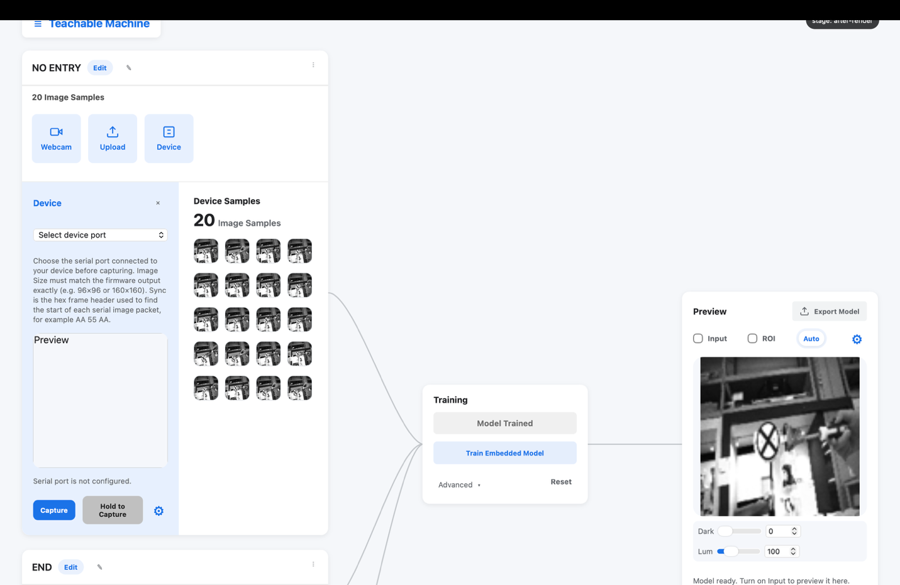
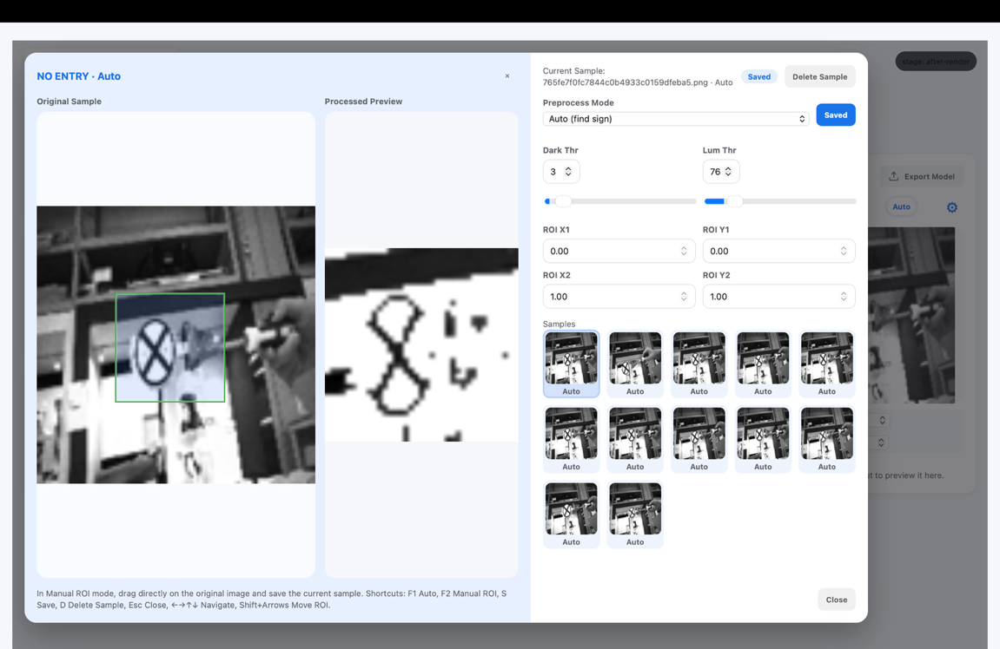
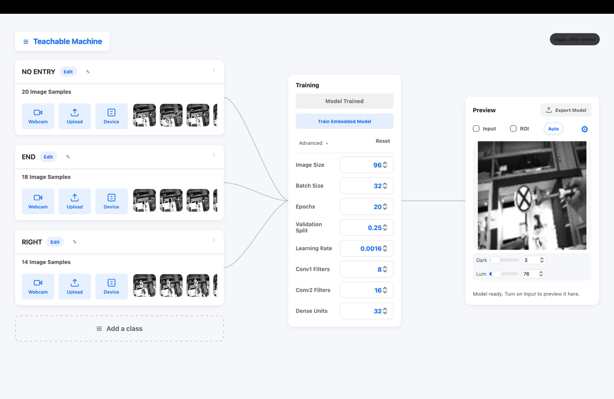
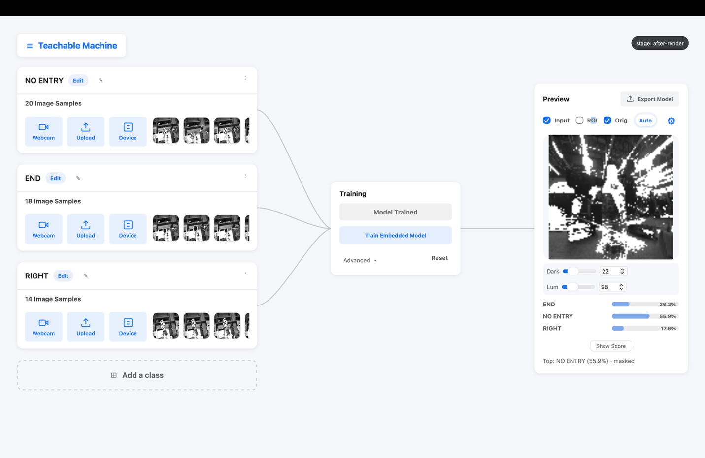
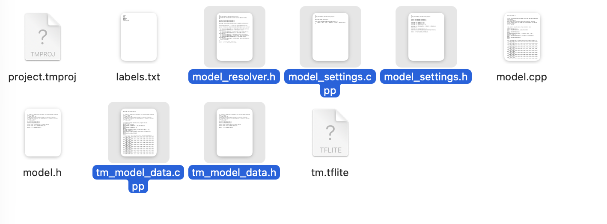

# Edge AI Vision Workshop — Project Lab Manual

> **Project objective: train a digit recognizer (0–9) and run it on the ESP32-P4.** Work through the steps in order; each required action is written out. The project is designed for **75–90 minutes**. If the software behaves differently from what this manual describes, consult an instructor before continuing.

---

## 0. The Project at a Glance

**Objective** — train a CNN that recognizes handwritten digits 0–9 presented on paper, and runs live on the ESP32-P4 board.

**Success criteria** (assessed at the final demonstration):

1. The model is deployed on the board and classifies live camera images
2. It classifies **at least 8 of 10** digits correctly on a set of **unseen** test digits written by someone other than the team
3. The team can explain one change made to improve the model and its observed effect

**Rules** — the model must be trained in this session, using samples collected in this session. Pre-trained networks are not permitted.

**Workflow** (identical to the road-sign demonstration in the lesson): Collect → Preprocess → Train → Test → Iterate → Export → Deploy.

---

## Provided Materials

The following kit is provided to each team. Verify it against this list before starting Part A.

| # | Item | Purpose |
| - | ---- | ------- |
| 1 | **Smart car** | The robot car carrying the ESP32-P4 board and camera module — the platform used for training and deployment |
| 2 | **Map** | The AIoScout playfield map — the surface on which the car and the road signs are set up |
| 3 | **Road sign stand** | Stand with 3 changeable signs, used in the lesson demonstration |
| 4 | **USB-C data cable** | Connects the board to the laptop for programming and image transfer |
| 5 | **Batteries ×2** | Power for the smart car |

Thick markers and blank paper for writing the digits in Part C are also provided.

Teams bring only a laptop with the pre-lab software installed (see the pre-lab manual).

---

## Part A — Setup Verification (5 min)

With the pre-lab installation complete, this part requires only a few minutes.

**A1.** Connect the board with the USB-C cable.

**A2.** In the Arduino IDE, select *Tools → Board → ESP32_mannual → ESP32P4 Dev Module*, and enter the board settings provided by the instructor (leave the Port unset at this stage).

**A3.** Open the provided **camera-stream sample sketch**, select the Port, and click **Upload**.

**A4.** Open the **Serial Monitor**. A continuous stream of garbled characters is the binary camera data; it indicates a successful upload.

**A5.** **Close the Serial Monitor.** The Serial Monitor occupies the port that the TFLiteTraining application requires. (A "port busy" error in the application later in the session is caused by leaving it open.)

---

## Part B — Create the Project (3 min)

**B1.** Open the TFLiteTraining application → **Open Project** → `template.tmproj`.

**B2.** Save an independent copy immediately: top-left menu → **Save Project** → name it `digits.tmproj`. Save the project at regular intervals from this point onward.

**B3.** Note the three areas of the workspace: **Sample** (left), **Train** (right), **Preview** (bottom).


*The three areas of the workspace*

---

## Part C — Collect the Data (20 min)

The dataset is the single largest factor in the quality of the final model. Follow this procedure.

**C1. Prepare the paper digits.** Use the provided thick marker and blank paper. Write each digit **large and bold** (about 8–10 cm tall), one digit per sheet; the sheets are held up to the camera.

**C2. Connect the camera.** In the Sample Area click **Device**, select the board's port, and open the **Gear** settings. Keep the defaults unchanged: **96×96 · Grayscale · 115200 · sync header AA 55 AA**. These values match the flashed sample code.


*Capture / Hold-to-Capture and the Gear settings — the defaults remain as shown*

**C3. Create the classes.** Create one class per digit: `0`, `1`, … `9`. If time is limited, begin with `1, 2, 3, 7` (see Part D) and add the remaining classes once the first version works — four reliable classes produce better results than ten unreliable ones.

**C4. Capture with variety.** For each class, capture **30–50 samples** using *Capture* (single image) or *Hold to Capture* (continuous). While capturing, vary the following between groups of shots:

- **Distance** — near, middle, far
- **Angle** — straight on, tilted left and right
- **Position** — centre and edges of the frame
- **Lighting** — orient toward different light sources
- **Rotation** — digits slightly rotated, as a driver would see them

Keep the sample counts **approximately equal** across classes. An unbalanced dataset biases the model toward the largest class.

**C5. Remove poor samples.** Hover over any blurry or accidental capture and click to delete it. Poor-quality samples degrade the trained model.

> **Why capture with Device rather than the laptop webcam?** The model will run behind the board's camera. Training on images from that same camera — the same lens, the same angle, the same lighting — gives the model the best conditions to succeed. This principle is known as *matching the deployment domain*.

---

## Part D — Preprocess (10 min)

**D1.** Click the **Edit** icon to enter the image-processing page. The left side is the **Image Viewer** (original and processed images); the right side is the **Sample Worktable**.


*Edit page — Image Viewer with ROI, and the Sample Worktable*

**D2. Choose a mode:**

- **Auto** (F1) — the application finds and crops the darkest region automatically. Use it when the digit is the darkest object in the frame.
- **Manual ROI** (F2) — the crop region is positioned manually (Shift + arrow keys move it). Use it when Auto selects shadows or the holding hand instead of the digit.

**D3. Set the thresholds** (they apply to the whole class):

- **Dark Thr** — pixels darker than this value become pure white; this removes dark shadows, sleeves, and background
- **Lum Thr** — pixels brighter than this value become pure white; this removes overexposed highlights

The target result: in the processed preview, the digit is black and almost everything else is white. Keep the thresholds moderate — if the digit itself begins to disappear, the thresholds are too aggressive.

**D4.** Move between samples with the arrow keys. Inspect several samples **of every class** and adjust the settings per class as needed.

**D5. Press S to save.** Unsaved preprocessing is discarded on exit; failure to save is the most common cause of lost work in this project.

**D6.** All processed images are resized automatically to `image size × image size` (default 96) before training. This is expected behaviour.

---

## Part E — Train (5 min)

**E1.** In the Train Area, click the **Advanced** icon. Begin with the default configuration:

| Parameter | Starting value |
| --------- | -------------- |
| Image size | 96 |
| Color mode | grayscale |
| Batch size | 16 |
| Epochs | 20 |
| Validation split | 0.25 |
| Learning rate | 0.001 |
| Conv1 / Conv2 filters | 8 / 16 |
| Dense units | 32 |

**E2.** Click **Train Embedded Model** and wait for training to complete.


*Advanced panel — set the hyperparameters, then Train Embedded Model*

**E3.** Read the **validation accuracy**. For 4–10 digit classes, a first run at or above 90% is a sound result. A result of 60–70% indicates that the data — not the hyperparameters — is the limiting factor: return to C4 (more variety) or D3 (cleaner preprocessing).

---

## Part F — Test on Unseen Data (10 min)

This step determines whether the model has learned the concept or has memorized the training set.

**F1.** In the Preview Area, click the **Gear** → source **Device** + the board's port.

**F2.** Toggle **Input** and present a digit written by **another team member** (not part of the training set).

**F3.** Read the **confidence bar** (toggle *show %*). The **ROI** display shows exactly what the model receives.


*Interpretation view — live image, ROI, and the confidence bar*

**F4.** Common confusions and their remedies:

| Confusion | Usual cause | Remedy |
| --------- | ----------- | ------ |
| 1 ↔ 7 | thin strokes, similar shapes | more samples; thicker marker; larger ROI |
| 3 ↔ 8, 9 ↔ 8 | loops closing up in gray | raise Dark Thr so faint loops vanish; add lighting variety |
| 4 ↔ 9 | open vs. closed top | more rotated variants of both digits |
| everything → one class | unbalanced dataset | equalize the sample counts (C4) |
| strong on training data, weak live | overfitting / insufficient variety | more varied samples; sometimes fewer epochs |

**F5.** After each remedy, retrain (E2) and retest. Two or three iterations are a normal part of the process.

---

## Part G — Export and Deploy (10 min)

**G1.** Click **Export model** and select a folder that is easy to locate. Then menu → **Save Project**.

**G2.** From the export folder, copy these **five files** into the `TFLite.ino` project folder, replacing the existing versions:


*The five export files, ready to be copied into the project folder*

```
tm_model_data.cpp     // the quantized model
tm_model_data.h
model_resolver.h
model_settings.cpp
model_settings.h
```

**G3.** Open `TFLite.ino` and confirm that **`IMG_SIZE` equals the image size used in training** (default 96). A mismatch supplies wrongly sized images to the model and produces meaningless predictions.

**G4.** Upload to the board, open the Serial Monitor, and present a digit: the model now classifies the live camera stream on the board itself.

---

## Part H — Final Evaluation (10 min)

**H1.** Ask another team (or the instructor) to write **10 test digits** that have never been shown to the model.

**H2.** Present each digit to the board and record the results:

| # | True digit | Predicted | Confidence | Correct? |
| - | ---------- | --------- | ---------- | -------- |
| 1 |            |           |            |          |
| 2 |            |           |            |          |
| … |           |           |            |          |
| 10 |           |           |            |          |

**H3.** A result of **≥ 8/10 correct completes the project.** Present the results table and the live demonstration to the instructor.

---

## Part I — Extensions (if time remains)

- **Sample efficiency:** delete samples until accuracy degrades — what is the minimum number of samples per class that still yields a working model?
- **Speed versus size:** set Conv1/Conv2/Dense to their maximum values and retrain; compare the inference rate on the serial output against the 4/8/16 configuration.
- **New handwriting:** have a member of another team add 10 samples of their handwriting to each class — does the model generalize better?
- **Failure boundaries:** present partial digits, distant digits, and digits at extreme angles, and document where the model begins to fail. This is its real-world operating boundary.

---

## Troubleshooting

| Symptom | Remedy |
| ------- | ------ |
| "Port busy" in the application | Close the Arduino Serial Monitor (A5) |
| No port in the Device list | Replug USB; use a data cable; confirm the board is powered |
| All predictions on one class, low confidence | Unbalanced or insufficient samples — see F4 |
| Export missing files | Re-export with the default settings; all five files generate together |
| Upload fails in the IDE | Board settings mismatch — compare against the instructor's settings |
