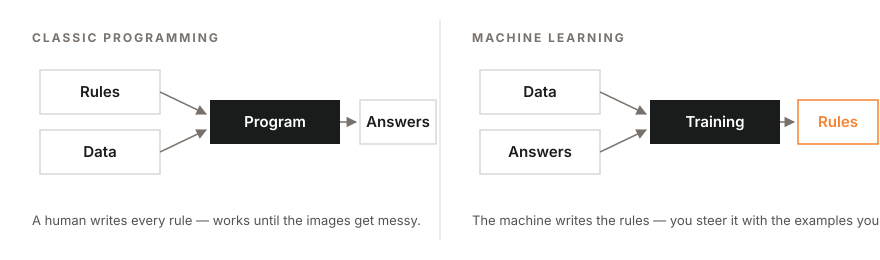
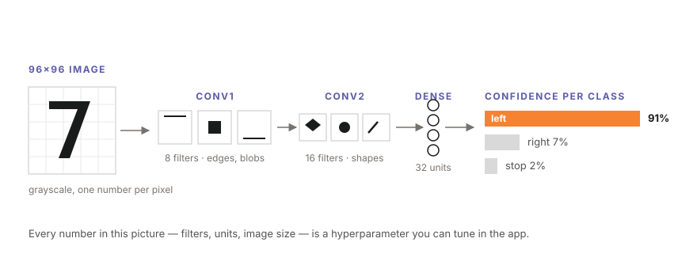
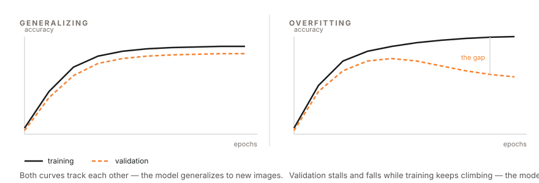
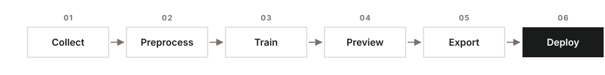

# Edge AI Vision Workshop — Pre-lab Manual

> This manual prepares you for the Edge AI Vision workshop. Complete the background reading (about 15 minutes) and the software installation (about 30 minutes) before the session. Students who arrive with the installation verified through the self-check in Section 4 can devote the full session to the project.

---

## 1. Overview of the Workshop

The workshop consists of a 45-minute lesson followed by a 90-minute project session. In the lesson, the instructor trains a small neural network to **recognize road signs** live on a microcontroller, demonstrating the complete workflow. In the project session, each team applies the same workflow to its own system: a **digit recognizer (0–9)** that runs on the same board.

All work runs on real hardware:

- The **ESP32-P4** development board with a camera module (provided at the workshop)
- The **TFLiteTraining** desktop application, which trains image classifiers without programming
- **TensorFlow Lite Micro**, Google's runtime that executes the trained model on the microcontroller itself

No programming experience is required. Every step in the lab manual is menu-driven and written out in full.

---

## 2. Background Reading (15 minutes)

This section introduces the concepts used in the lesson. The material does not need to be memorized, but familiarity with these terms makes the lesson considerably easier to follow.

### 2.1 Rules versus learning

A conventional program follows rules written by a programmer: *"if the pixel is dark, do X."* Such rules are sufficient for blinking an LED, but they cannot recognize a road sign in a photograph — no one can write those rules by hand. **Machine learning** inverts this arrangement: instead of receiving rules, the computer receives many **labeled examples** (images with the correct answer attached) and derives the rules itself. This process is called **training**.

*Inputs and outputs of classic programming versus machine learning*

### 2.2 Convolutional neural networks

A **Convolutional Neural Network (CNN)** is the standard neural-network architecture for images. It can be understood as a stack of small **feature detectors**: the first layers detect simple patterns such as edges and blobs; deeper layers combine these into shapes and objects; the final layer outputs a **confidence** for each class — for example, "left arrow: 91%, right arrow: 7%, wall: 2%". The CNN used in this workshop is small enough to run on a microcontroller in real time.

*A small CNN, end to end: image → feature detectors → one confidence score per class*

### 2.3 Overfitting and validation

A model may **memorize** its training images instead of **learning** the underlying concept — like a student who memorizes past examination papers but cannot answer a new question. This failure mode is called **overfitting**. It is detected by holding part of the dataset out of training (the **validation split**) and evaluating the model on those unseen images. The project session applies this principle directly: each digit recognizer is tested on handwriting that was never part of its training data.

*Reading the training curves: healthy training (left) versus overfitting (right)*

### 2.4 Edge AI and quantization

Sending camera images to a server introduces delay and requires network access. **Edge AI** runs the model directly on the device instead. To fit the microcontroller's memory, the model is **quantized** to **int8** — each number stored as 1 byte instead of 4 — which makes it roughly 4× smaller and faster at a negligible cost in accuracy. **TensorFlow Lite Micro** (now called LiteRT for Microcontrollers) is the runtime that executes such models on microcontrollers in as little as 16 KB of memory.

### 2.5 The ESP32-P4 development board

The **ESP32-P4** is a high-performance microcontroller from Espressif. It provides a dual-core processor, camera support (for example the IMX219 module), and sufficient processing speed to run image classification in real time. It is programmed with the **Arduino IDE** over a USB cable.

### 2.6 The TFLiteTraining application

**TFLiteTraining** is a desktop application (inspired by Google's Teachable Machine) that provides the complete training pipeline in a single window: **collect** images → **preprocess** (crop and clean) → **train** → **preview** live → **export** the model as files ready for the board.

*The six-step workflow, applied to road signs in the lesson and to digits in the project*

---

## 3. Software Checklist (complete before the session)

Install the following items in order. The versions matter: the workshop instructions assume them.

| # | Item | Version | Where / Notes |
| - | ---- | ------- | ------------- |
| 1 | **Arduino IDE** | 2.3.10 or higher | https://www.arduino.cc/en/software |
| 2 | **esp32 board package** | **exactly 3.3.1** | In the IDE: Settings → *Additional Boards Manager URLs* → add `https://dl.espressif.com/dl/package_esp32_index.json` → OK. Then *Tools → Board → Board Manager* → search "esp32" → install **esp32 by Espressif Systems, version 3.3.1** |
| 3 | **esp32_mannual core** | as provided | Unzip `esp32_mannual.zip` (distributed with this manual) into your Arduino hardware folder — see the paths below |
| 4 | **TFLiteTraining app** | as provided | Install from the `.dmg` (macOS) or `.exe` (Windows) distributed with this manual. Do not launch it yet |
| 5 | **template project** | `template.tmproj` | Download it; it is opened during the workshop |

**Installation path for the esp32_mannual folder** — after unzipping, the final path must be:

- **macOS:** `/Users/<you>/Documents/Arduino/hardware/esp32_mannual`
- **Windows:** `C:\Users\<you>\Documents\Arduino\hardware\esp32_mannual`

If the `Arduino/hardware` folder does not exist, create it.

---

## 4. Self-Check (2 minutes, the day before)

1. Open the Arduino IDE
2. Open *Tools → Board*
3. Confirm that an entry named **ESP32_mannual** appears in the list, containing the **ESP32P4 Dev Module**

If the entry is present, the installation is complete. If it is absent, the esp32_mannual folder was placed in the wrong location — verify the path against Section 3.

---

## 5. What to Bring

- A laptop with the software in Section 3 installed and **fully charged** (power sockets may be limited)

All other materials — the car kit, the USB-C cable, and the stationery used in the project — are provided at the session. The project lab manual lists them in full.

---

## 6. Troubleshooting the Installation

**The port does not appear in the IDE.** Use another USB port and another cable; charge-only cables are the most common cause. On Windows, the CH34x/CP210x driver may be required.

**"esp32" appears in Board Manager, but version 3.3.1 is not listed.** Confirm that the Espressif board URL (Section 3, item 2) was added *before* opening Board Manager, then refresh.

**macOS reports that the application "cannot be opened because it is from an unidentified developer".** Right-click the application → Open → Open.

**An older Arduino IDE is already installed.** Install 2.3.10 or higher alongside it and use that version for the workshop.

---

## 7. Workshop Materials

All workshop materials — the lesson slides and the project lab manual — are published on the workshop page from which this manual was downloaded.
